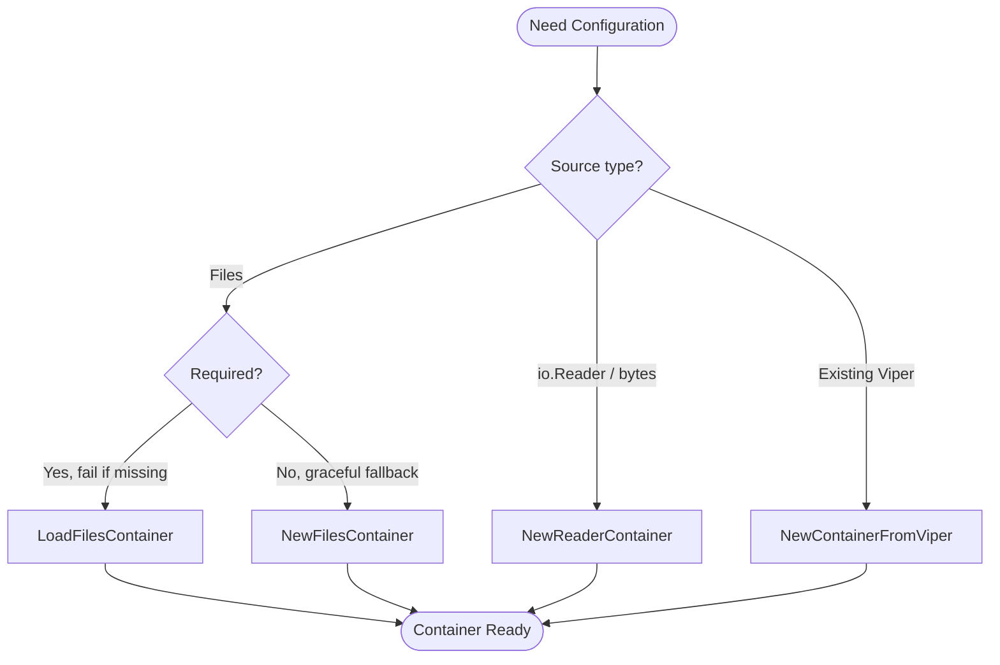

# Configuration

The Configuration component provides a flexible and powerful abstraction over the `spf13/viper` configuration library. It delivers enhanced functionality for configuration loading and management while adding crucial testability features that are not available with viper directly.

## Overview

The configuration system is built around the `Containable` interface and the `Container` struct, providing a unified API for accessing configuration values regardless of their source. The package adds several key improvements over raw viper usage:

**Enhanced Testability**: Unlike viper, which is difficult to mock effectively, the `Containable` interface enables clean dependency injection and comprehensive testing strategies.

**Observer Pattern**: Adds filesystem watching with an observer pattern for configuration changes, allowing your application to react to configuration updates automatically.

**Simplified API**: Provides convenience methods for common configuration tasks while maintaining access to the underlying viper instance when needed.

**Multiple Source Support**: Handles configuration loading from files, embedded resources, environment variables, and command-line flags with automatic merging and type conversion.

## Core Interface

The `Containable` interface provides the primary API for configuration access:

```go
type Containable interface {
    Get(key string) any
    GetBool(key string) bool
    GetInt(key string) int
    GetFloat(key string) float64
    GetString(key string) string
    GetTime(key string) time.Time
    GetDuration(key string) time.Duration
    GetViper() *viper.Viper
    Has(key string) bool
    IsSet(key string) bool
    Set(key string, value any)
    WriteConfigAs(dest string) error
    Sub(key string) Containable
    AddObserver(o Observable)
    AddObserverFunc(f func(Containable, chan error))
    ToJSON() string
    Dump()
}
```

## Container Implementation

The `Container` struct is the primary implementation of the `Containable` interface. Engineers should use this concrete type rather than the interface directly, except for testing and dependency injection:

```go
type Container struct {
    ID        string
    viper     *viper.Viper
    logger    *slog.Logger
    observers []Observable
}

// Core factory functions:
func NewFilesContainer(l *slog.Logger, fs afero.Fs, configFiles ...string) *Container
func NewReaderContainer(l *slog.Logger, format string, configReaders ...io.Reader) *Container
```

---

## Factory Function Selection Guide

GTB provides several factory functions for creating configuration containers. This section helps you choose the right one for your use case.

### Quick Reference

| Factory Function | Use Case | Error Handling | File Watching |
| :--- | :--- | :--- | :--- |
| `NewFilesContainer` | Application startup with optional files | Logs warnings, continues | ✓ Enabled |
| `LoadFilesContainer` | Strict loading where config is required | Returns error | ✗ Disabled |
| `NewReaderContainer` | Testing or embedded config streams | Logs warnings, continues | ✗ Disabled |
| `NewContainerFromViper` | Wrapping existing Viper instances | N/A | Depends on Viper |

### NewFilesContainer

**Best for:** Production applications where some config files may not exist.

```go
container := config.NewFilesContainer(logger, fs, 
    "config.yaml",      // Primary config (may not exist)
    "config.local.yaml", // Local overrides (may not exist)
)
```

**Behavior:**

- Silently continues if files don't exist
- Logs warnings for parse errors but doesn't fail
- Automatically enables file watching for hot-reload
- Merges files in order (later files override earlier ones)

### LoadFilesContainer

**Best for:** Scenarios where configuration is mandatory.

```go
container, err := config.LoadFilesContainer(logger, fs,
    "config.yaml",       // MUST exist
    "config.local.yaml", // Optional override
)
if err != nil {
    return fmt.Errorf("configuration required: %w", err)
}
```

**Behavior:**

- Returns error if the **first** file doesn't exist
- Subsequent files are optional (merged if present)
- No file watching (single load operation)
- Preferred for CLI tools that require explicit configuration

### NewReaderContainer

**Best for:** Testing and programmatic configuration.

```go
// From strings (testing)
configYAML := `
app:
  name: test-app
  debug: true
`
container := config.NewReaderContainer(logger, "yaml", 
    strings.NewReader(configYAML),
)

// From embedded bytes
container := config.NewReaderContainer(logger, "yaml",
    bytes.NewReader(defaultConfigBytes),
    bytes.NewReader(envSpecificBytes),
)
```

**Behavior:**

- Accepts `io.Reader` instead of file paths
- Must specify format explicitly ("yaml", "json", "toml")
- No file watching (readers are consumed once)
- Ideal for unit tests with controlled configuration

### NewContainerFromViper

**Best for:** Integration with existing Viper-based code.

```go
// When you already have a configured Viper instance
v := viper.New()
v.SetConfigFile("legacy-config.yaml")
v.ReadInConfig()

container := config.NewContainerFromViper(logger, v)
```

**Behavior:**

- Wraps existing Viper without modification
- Inherits all Viper settings (watchers, env bindings, etc.)
- Useful for gradual migration to GTB patterns

### Decision Flowchart



---

## Configuration Sources

### 1. File-Based Configuration

Load configuration from YAML files using the simplified `Load` function or create containers directly:

```go
// Using the convenience Load function
fs := afero.NewOsFs()
paths := []string{"config.yaml", "config.yml", "/etc/myapp/config.yaml"}

container, err := config.Load(paths, fs, logger, false)
if err != nil {
    log.Fatal(err)
}

// Or create a Container directly
slogger := slog.New(props.Logger)
container := config.NewFilesContainer(slogger, fs, "config.yaml", "local.yaml")
```

**Example config.yaml:**
```yaml
app:
  name: "my-application"
  debug: false
  port: 8080

database:
  host: "localhost"
  port: 5432
  name: "myapp"
  timeout: "30s"

features:
  - "auth"
  - "logging"
  - "metrics"
```

### 2. Embedded Configuration

Load configuration from embedded files (useful for default configurations). The library supports loading and merging configurations from multiple embedded filesystem instances.

!!! warning "Naming Convention & Path Requirement"
    For automated configuration loading and merging (especially during `init`), the library expects the following structure within your `embed.FS`:

    *   **Path**: `assets/init/config.yaml`
    *   **Embed Directive**: `//go:embed assets/*` (ensure all subdirectories are included)

### Root Command Integration

When building a modular CLI where each subcommand manages its own configuration, you should collect all assets into a slice and pass them to the root command creator:

```go
// pkg/cmd/root/root.go

//go:embed assets/*
var assets embed.FS

func NewCmdRoot(props *props.Props) *cobra.Command {
    // 1. Initialize subcommands and collect their assets
    trainCmd, trainAssets := train.NewCmdTrain(props)
    kubeCmd, kubeAssets := kube.NewCmdKube(props)

    // 2. Aggregate all assets (root assets + subcommand assets)
    allAssets := []embed.FS{assets}
    for _, a := range []*embed.FS{trainAssets, kubeAssets} {
        if a != nil {
            allAssets = append(allAssets, *a)
        }
    }

    // 3. Create the root command with the full slice of assets
    // This allows the configuration system to search across ALL modules
    rootCmd := root.NewCmdRoot(props, allAssets)

    // 4. Add the subcommands to the root
    rootCmd.AddCommand(trainCmd)
    rootCmd.AddCommand(kubeCmd)

    return rootCmd
}
```

The library searches all provided assets for the `assets/init/config.yaml` path and merges them together during both application startup and the `init` command process.

### 3. Environment Variable Integration

The Container automatically handles environment variables using viper's built-in functionality:

```go
// Environment variables are automatically mapped
// For config key "database.host", environment variable "DATABASE_HOST" is checked
// Key separator "." is replaced with "_" in environment variable names

container := config.NewFilesContainer(logger, fs, "config.yaml")

// This will check DATABASE_HOST environment variable
host := container.GetString("database.host")
```

### 4. Local Dotenv Support

For local development, the configuration system automatically looks for and loads environment variables from a `.env` file in the current working directory.

!!! tip "Local Overrides"
    The `.env` loader is initialized automatically by every `Container`. This is the recommended way to manage local API keys and tokens without modifying your `config.yaml`.

### 5. Configuration Merging

Combine multiple configuration files with automatic merging:

```go
// Multiple files are merged in order, with later files taking precedence
container := config.NewFilesContainer(logger, fs,
    "defaults.yaml",    // Base configuration
    "config.yaml",      // Environment-specific
    "local.yaml")       // Local overrides

// The Load function also supports merging from multiple discovered files
paths := []string{"config.yaml", "config.local.yaml", "/etc/myapp/config.yaml"}
container, err := config.Load(paths, fs, logger, false)
```

## Usage Examples

### Basic Value Access

```go
// Simple value access
appName := container.GetString("app.name")
debugMode := container.GetBool("app.debug")
port := container.GetInt("app.port")

// Type conversion with automatic handling
timeout := container.GetDuration("database.timeout") // "30s" -> 30 * time.Second
startTime := container.GetTime("app.start_time")
maxSize := container.GetFloat("cache.max_size")

// Check if a key exists
if container.Has("feature.experimental") {
    experimental := container.GetBool("feature.experimental")
    // Handle experimental feature
}
```

### Hierarchical Configuration

```go
// Access nested configuration sections using Sub()
dbConfig := container.Sub("database")
if dbConfig != nil {
    host := dbConfig.GetString("host")
    port := dbConfig.GetInt("port")
    name := dbConfig.GetString("name")

    connectionString := fmt.Sprintf("%s:%d/%s", host, port, name)
}

// Sub returns a new Containable for the nested section
cacheConfig := container.Sub("cache")
redisConfig := cacheConfig.Sub("redis") // Nested: cache.redis.*
```

Configuration works seamlessly with Cobra flags:

```go
func NewDatabaseCommand(props *props.Props) *cobra.Command {
    var dbHost string

    cmd := &cobra.Command{
        Use:   "database",
        Short: "Database operations",
        RunE: func(cmd *cobra.Command, args []string) error {
            // Flag takes precedence over config
            if dbHost == "" {
                dbHost = props.Config.GetString("database.host")
            }

            props.Logger.Info("Connecting to database", "host", dbHost)
            return nil
        },
    }

    cmd.Flags().StringVar(&dbHost, "db-host", "", "Database host")

    return cmd
}
```

## Advanced Features

### Configuration Validation

```go
func validateConfig(cfg config.Containable) error {
    required := []string{
        "app.name",
        "database.host",
        "database.port",
    }

    for _, key := range required {
        if cfg.GetString(key) == "" {
            return fmt.Errorf("required configuration key '%s' is missing", key)
        }
    }

    // Validate ranges
    port := cfg.GetInt("database.port")
    if port < 1 || port > 65535 {
        return fmt.Errorf("database.port must be between 1 and 65535, got %d", port)
    }

    return nil
}
```

## Observer Pattern for Configuration Changes

The configuration system includes a built-in observer pattern that monitors filesystem changes and notifies registered observers when configuration files are updated.

### Observable Interface

```go
type Observable interface {
    Run(Containable, chan error)
}

type Observer struct {
    handler func(Containable, chan error)
}
```

### Adding Observers

Register observers to react to configuration changes:

```go
// Using the Observable interface
type ConfigWatcher struct {
    name string
}

func (cw *ConfigWatcher) Run(cfg config.Containable, errs chan error) {
    // React to configuration changes
    newPort := cfg.GetInt("app.port")
    fmt.Printf("Configuration updated - new port: %d\n", newPort)

    // Signal any errors back through the channel
    if newPort < 1024 {
        errs <- fmt.Errorf("invalid port number: %d", newPort)
    }
}

// Register the observer
watcher := &ConfigWatcher{name: "port-monitor"}
container.AddObserver(watcher)

// Or use a function directly
container.AddObserverFunc(func(cfg config.Containable, errs chan error) {
    logger.Info("Configuration reloaded", "timestamp", time.Now())
})
```

### Automatic File Watching

When using multiple configuration files, the Container automatically watches for changes:

```go
// This enables file watching automatically
container := config.NewFilesContainer(logger, fs, "config.yaml", "local.yaml")

// File watching triggers observers when config files change
container.AddObserverFunc(func(cfg config.Containable, errs chan error) {
    // This will be called whenever config.yaml or local.yaml changes
    newLogLevel := cfg.GetString("log.level")
    // Reconfigure logging, restart services, etc.
})
```

## Testing and Mocking

One of the primary benefits of the config package is enhanced testability. Unlike viper, which is difficult to mock, the `Containable` interface enables comprehensive testing strategies.

### Creating Test Configurations

```go
func TestMyFunction(t *testing.T) {
    // Create in-memory configuration for testing
    logger := slog.New(slog.NewTextHandler(io.Discard, nil))

    // Using a YAML string for test config
    testConfigYAML := `
app:
  name: "test-app"
  debug: true
  port: 8080
database:
  host: "localhost"
  port: 5432
  name: "testdb"
`

    reader := strings.NewReader(testConfigYAML)
    container := config.NewReaderContainer(logger, "yaml", reader)

    // Test your function with the test configuration
    result := MyFunctionThatNeedsConfig(container)
    assert.Equal(t, "expected", result)
}
```

### Mock Configuration Interface

The GTB library includes auto-generated mocks using [mockery](https://github.com/vektra/mockery). **Use these provided mocks instead of creating manual implementations:**

```go
import (
    "testing"

    "github.com/phpboyscout/gtb/mocks/pkg/config"
    "github.com/stretchr/testify/assert"
)

func TestWithProvidedMocks(t *testing.T) {
    // Use the auto-generated mock
    mockConfig := config.NewMockContainable(t)

    // Set up expectations
    mockConfig.EXPECT().GetString("database.host").Return("test-host")
    mockConfig.EXPECT().GetInt("database.port").Return(5432)
    mockConfig.EXPECT().GetString("database.name").Return("testdb")
    mockConfig.EXPECT().Has("database.ssl").Return(true)
    mockConfig.EXPECT().GetBool("database.ssl").Return(false)

    // Test your function
    service := NewDatabaseService(mockConfig)
    err := service.Connect()
    assert.NoError(t, err)

    // Expectations are automatically verified on cleanup
}

func TestConfigSubSection(t *testing.T) {
    mockConfig := config.NewMockContainable(t)
    mockSubConfig := config.NewMockContainable(t)

    // Mock Sub() method to return another mock
    mockConfig.EXPECT().Sub("database").Return(mockSubConfig)
    mockSubConfig.EXPECT().GetString("host").Return("localhost")
    mockSubConfig.EXPECT().GetInt("port").Return(5432)

    // Use the mocked configuration
    dbConfig := mockConfig.Sub("database")
    host := dbConfig.GetString("host")
    port := dbConfig.GetInt("port")

    assert.Equal(t, "localhost", host)
    assert.Equal(t, 5432, port)
}
```

### Available Generated Mocks

The library provides the following auto-generated mocks in the `mocks/config` package:

- **`MockContainable`** - Mock implementation of the `Containable` interface
- **`MockObservable`** - Mock implementation of the `Observable` interface
- **`MockEmbeddedFileReader`** - Mock implementation of the `EmbeddedFileReader` interface

**Benefits of Using Provided Mocks:**

- **Type Safety**: Automatically generated from the actual interfaces
- **Comprehensive**: All interface methods are properly mocked
- **Test Integration**: Built-in support for testify assertions and cleanup
- **Maintenance**: Updated automatically when interfaces change

### Testing Observer Behavior

Testing observers is important because they often contain critical business logic that responds to configuration changes. Since observers in production are triggered by filesystem changes, testing requires special approaches.

#### Why Test Observers?

- **Critical Logic**: Observers often restart services, update logging levels, or reconfigure security settings
- **Error Handling**: Observers can signal configuration validation errors through error channels
- **Concurrency**: Observers run concurrently and need proper error handling and synchronization

#### Testing Strategies

**1. Testing Observer Logic with Mock Configurations:**

```go
import (
    "testing"
    "time"

    "github.com/phpboyscout/gtb/mocks/pkg/config"
    "github.com/stretchr/testify/assert"
)

func TestLogLevelObserver(t *testing.T) {
    // Create a mock configuration
    mockConfig := config.NewMockContainable(t)

    // Set up expectations for the observer
    mockConfig.EXPECT().GetString("log.level").Return("debug")
    mockConfig.EXPECT().Has("log.level").Return(true)

    // Test the observer logic directly
    observerCalled := false
    errorsCh := make(chan error, 1)

    observer := &LogLevelObserver{
        onLevelChange: func(level string) {
            observerCalled = true
            assert.Equal(t, "debug", level)
        },
    }

    // Run the observer with mock config
    observer.Run(mockConfig, errorsCh)

    // Verify observer was called
    assert.True(t, observerCalled)

    // Check no errors were reported
    select {
    case err := <-errorsCh:
        t.Fatalf("Unexpected error: %v", err)
    default:
        // No error, which is expected
    }
}
```

**2. Testing Observer Registration and Integration:**

```go
func TestObserverRegistration(t *testing.T) {
    logger := slog.New(slog.NewTextHandler(io.Discard, nil))

    // Create container with test config
    reader := strings.NewReader(`
log:
  level: "info"
database:
  host: "localhost"
`)
    container := config.NewReaderContainer(logger, "yaml", reader)

    // Track observer execution
    observerCalled := false
    errorCount := 0

    // Add observer function
    container.AddObserverFunc(func(cfg config.Containable, errs chan error) {
        observerCalled = true

        // Test configuration access within observer
        logLevel := cfg.GetString("log.level")
        if logLevel == "" {
            errs <- errors.New("log level not configured")
            return
        }

        // Validate configuration
        if logLevel != "debug" && logLevel != "info" && logLevel != "warn" && logLevel != "error" {
            errs <- fmt.Errorf("invalid log level: %s", logLevel)
        }
    })

    // Simulate observer execution (since file watching isn't available in tests)
    // In real usage, this would be triggered by file system changes
    errorsCh := make(chan error, 10)
    wg := &sync.WaitGroup{}

    // Execute observers manually
    observers := container.GetObservers()
    for _, observer := range observers {
        wg.Add(1)
        go func(obs config.Observable) {
            defer wg.Done()
            obs.Run(container, errorsCh)
        }(observer)
    }

    wg.Wait()
    close(errorsCh)

    // Check results
    assert.True(t, observerCalled, "Observer should have been called")

    // Count any errors
    for err := range errorsCh {
        t.Logf("Observer error: %v", err)
        errorCount++
    }

    assert.Equal(t, 0, errorCount, "No observer errors expected")
}
```

**3. Testing Observer Error Handling:**

```go
func TestObserverErrorHandling(t *testing.T) {
    logger := slog.New(slog.NewTextHandler(io.Discard, nil))

    // Create container with invalid config
    reader := strings.NewReader(`
log:
  level: "invalid_level"  # This should trigger an error
`)
    container := config.NewReaderContainer(logger, "yaml", reader)

    // Add observer that validates configuration
    container.AddObserverFunc(func(cfg config.Containable, errs chan error) {
        logLevel := cfg.GetString("log.level")
        validLevels := []string{"debug", "info", "warn", "error"}

        isValid := false
        for _, valid := range validLevels {
            if logLevel == valid {
                isValid = true
                break
            }
        }

        if !isValid {
            errs <- fmt.Errorf("invalid log level '%s', must be one of: %v", logLevel, validLevels)
        }
    })

    // Execute observer and capture errors
    errorsCh := make(chan error, 10)
    observers := container.GetObservers()

    for _, observer := range observers {
        observer.Run(container, errorsCh)
    }
    close(errorsCh)

    // Verify error was reported
    errorCount := 0
    for err := range errorsCh {
        assert.Contains(t, err.Error(), "invalid log level")
        errorCount++
    }

    assert.Equal(t, 1, errorCount, "Expected exactly one validation error")
}
```

**4. Testing Custom Observer Implementation:**

```go
// Example custom observer for testing
type TestServiceRestarter struct {
    restartCalled bool
    serviceName   string
}

func (t *TestServiceRestarter) Run(cfg config.Containable, errs chan error) {
    if cfg.Has("service.restart_required") && cfg.GetBool("service.restart_required") {
        t.restartCalled = true
        // Simulate service restart logic
        if t.serviceName == "" {
            errs <- errors.New("service name not configured")
        }
    }
}

func TestCustomObserver(t *testing.T) {
    mockConfig := config.NewMockContainable(t)
    mockConfig.EXPECT().Has("service.restart_required").Return(true)
    mockConfig.EXPECT().GetBool("service.restart_required").Return(true)

    observer := &TestServiceRestarter{serviceName: "test-service"}
    errorsCh := make(chan error, 1)

    observer.Run(mockConfig, errorsCh)

    assert.True(t, observer.restartCalled)

    // Verify no errors
    select {
    case err := <-errorsCh:
        t.Fatalf("Unexpected error: %v", err)
    default:
        // Success - no errors
    }
}
```

#### Best Practices for Testing Observers

1. **Test Observer Logic Separately**: Test the business logic within observers using mock configurations
2. **Test Error Handling**: Ensure observers properly report validation and runtime errors
3. **Test Concurrency**: Observers run concurrently, so test with multiple observers
4. **Mock Dependencies**: Use mock configurations to control test scenarios
5. **Verify Side Effects**: Test that observers actually perform their intended actions (logging, service restarts, etc.)

## Debugging and Introspection

### Configuration Debugging

The Container provides methods for inspecting configuration state, which is crucial when values aren't loading as expected.

#### Inspecting Loaded Values

```go
// Print all configuration values as JSON to stdout (great for quick debugging)
container.Dump()

// Get configuration as JSON string for structured logging
configJSON := container.ToJSON()
logger.Info("Current configuration", "config", configJSON)
```

#### Verifying Sources

If you aren't sure where a value is coming from (File vs Env vs Flag):

1.  **Flags** have the highest precedence.
2.  **Environment Variables** come next.
3.  **Configuration Files** are updated in the order they were loaded (later files override earlier ones).

To debug, you can inspect the underlying Viper instance:

```go
// Access underlying viper for advanced operations
viper := container.GetViper()
allSettings := viper.AllSettings()
```

For general runtime issues, see the [Troubleshooting Guide](../troubleshooting.md).

### Configuration Validation

```go
func validateConfig(cfg config.Containable) error {
    required := []string{
        "app.name",
        "database.host",
        "database.port",
    }

    for _, key := range required {
        if !cfg.Has(key) {
            return fmt.Errorf("required configuration key '%s' is missing", key)
        }
    }

    // Validate ranges
    port := cfg.GetInt("database.port")
    if port < 1 || port > 65535 {
        return fmt.Errorf("database.port must be between 1 and 65535, got %d", port)
    }

    return nil
}
```

## Containable Interface (For Testing and Mocking)

The `Containable` interface is primarily used for testing and when working with provided mocks. In production code, use the concrete `Container` type:

```go
type Containable interface {
    Get(key string) any
    GetBool(key string) bool
    GetInt(key string) int
    GetFloat(key string) float64
    GetString(key string) string
    GetTime(key string) time.Time
    GetDuration(key string) time.Duration
    GetViper() *viper.Viper
    Has(key string) bool
    IsSet(key string) bool
    Set(key string, value any)
    WriteConfigAs(dest string) error
    Sub(key string) Containable
    AddObserver(o Observable)
    AddObserverFunc(f func(Containable, chan error))
    ToJSON() string
    Dump()
}
```

## Best Practices

### 1. Use Concrete Types in Production

- Use `*config.Container` for production configuration management
- Use `config.Containable` interface for testing and dependency injection
- Reserve the interface for mocking and testing scenarios

### 2. Configuration Loading Strategy

```go
// Recommended: Use multiple configuration files with precedence
func setupConfiguration(logger *slog.Logger, fs afero.Fs) (*config.Container, error) {
    // Load in order of precedence (later files override earlier ones)
    container := config.NewFilesContainer(logger, fs,
        "defaults.yaml",      // Base defaults
        "config.yaml",        // Environment configuration
        "local.yaml",         // Local overrides
    )

    return container, validateConfig(container)
}
```

### 3. Error Handling

- Always validate required configuration keys
- Provide meaningful error messages for missing or invalid configuration
- Use the `Has()` method to check for optional configuration

### 4. Observer Pattern Usage

```go
// Use observers for configuration-dependent services
func setupConfigWatching(container *config.Container, logger *slog.Logger) {
    container.AddObserverFunc(func(cfg config.Containable, errs chan error) {
        // Reconfigure logging level
        if cfg.Has("log.level") {
            newLevel := cfg.GetString("log.level")
            // Update logger configuration
        }

        // Handle any errors
        if someValidationFails {
            errs <- fmt.Errorf("configuration validation failed")
        }
    })
}
```

### 5. Testing Configuration

- Use `NewReaderContainer` for simple test configurations
- Create helper functions for common test configuration setups
- Mock the `Containable` interface for unit tests that need specific configuration behavior

### 6. Environment Variable Integration

```go
// Take advantage of automatic environment variable mapping
// For config key "database.connection.host"
// Environment variable "DATABASE_CONNECTION_HOST" will be checked automatically

func getDatabaseConfig(cfg config.Containable) DatabaseConfig {
    return DatabaseConfig{
        Host:     cfg.GetString("database.connection.host"),     // Checks DATABASE_CONNECTION_HOST
        Port:     cfg.GetInt("database.connection.port"),        // Checks DATABASE_CONNECTION_PORT
        Database: cfg.GetString("database.connection.database"), // Checks DATABASE_CONNECTION_DATABASE
        Username: cfg.GetString("database.connection.username"), // Checks DATABASE_CONNECTION_USERNAME
        Password: cfg.GetString("database.connection.password"), // Checks DATABASE_CONNECTION_PASSWORD
    }
}
```

### 7. Configuration Debugging

```go
// Add debugging support for configuration issues
func debugConfiguration(cfg *config.Container, logger *slog.Logger) {
    if cfg.GetBool("debug.config") {
        logger.Info("Current configuration:", "config", cfg.ToJSON())

        // Log observer count
        observers := cfg.GetObservers()
        logger.Info("Configuration observers registered", "count", len(observers))
    }
}
```

## Integration with GTB

The configuration component integrates seamlessly with other GTB components:

```go
// In your Props setup
func setupProps() (*props.Props, error) {
    logger := slog.New(props.Logger)
    fs := afero.NewOsFs()

    // Load configuration
    cfg := config.NewFilesContainer(logger, fs, "config.yaml")

    // Create Props with configuration
    p := &props.Props{
        Config: cfg,
        Logger: logger,
        FS:     fs,
    }

    return p, nil
}
```

This configuration component provides the foundation for all other GTB components, offering consistent configuration access patterns while maintaining excellent testability through the abstraction layer over viper.


### 2. Feature Flags

```yaml
# config.yaml
features:
  auth: true
  telemetry: false
  experimental_ui: true
```

```go
func isFeatureEnabled(cfg config.Containable, feature string) bool {
    return cfg.GetBool("features." + feature)
}

func requireFeature(cfg config.Containable, feature string) error {
    if !isFeatureEnabled(cfg, feature) {
        return fmt.Errorf("feature '%s' is not enabled", feature)
    }
    return nil
}
```

### 3. Configuration Sections

```go
type DatabaseConfig struct {
    Host     string        `yaml:"host"`
    Port     int           `yaml:"port"`
    Name     string        `yaml:"name"`
    Timeout  time.Duration `yaml:"timeout"`
}

func loadDatabaseConfig(cfg config.Containable) (*DatabaseConfig, error) {
    dbSection := cfg.Sub("database")
    if dbSection == nil {
        return nil, fmt.Errorf("database configuration section not found")
    }

    return &DatabaseConfig{
        Host:    dbSection.GetString("host"),
        Port:    dbSection.GetInt("port"),
        Name:    dbSection.GetString("name"),
        Timeout: dbSection.GetDuration("timeout"),
    }, nil
}
```

## Best Practices

### 1. Configuration Keys

Use consistent, hierarchical naming:

```yaml
# Good: Hierarchical and descriptive
app:
  name: "myapp"
  server:
    port: 8080
    timeout: "30s"
database:
  connection:
    host: "localhost"
    port: 5432

# Avoid: Flat, unclear naming
appname: "myapp"
serverport: 8080
dbhost: "localhost"
```

### 2. Default Values

Always provide sensible defaults:

```go
func getConfigWithDefaults(cfg config.Containable) Config {
    return Config{
        Port:           cfg.GetInt("server.port"),           // 0 if not set
        Timeout:        cfg.GetDuration("server.timeout"),   // 0 if not set
        MaxConnections: max(cfg.GetInt("server.max_connections"), 100), // Default to 100
    }
}
```

### 3. Type Safety

Use specific getter methods for type safety:

```go
// Good: Type-safe access
port := cfg.GetInt("server.port")
timeout := cfg.GetDuration("server.timeout")
enabled := cfg.GetBool("feature.enabled")

// Avoid: Generic access requiring type assertions
port := cfg.Get("server.port").(int) // Panic if wrong type
```

### 4. Error Handling

Handle missing configuration gracefully:

```go
func setupService(cfg config.Containable) (*Service, error) {
    host := cfg.GetString("service.host")
    if host == "" {
        return nil, fmt.Errorf("service.host is required")
    }

    port := cfg.GetInt("service.port")
    if port == 0 {
        port = 8080 // Default
    }

    return NewService(host, port), nil
}
```

The Configuration component provides a robust and flexible foundation for managing application settings in GTB applications.
