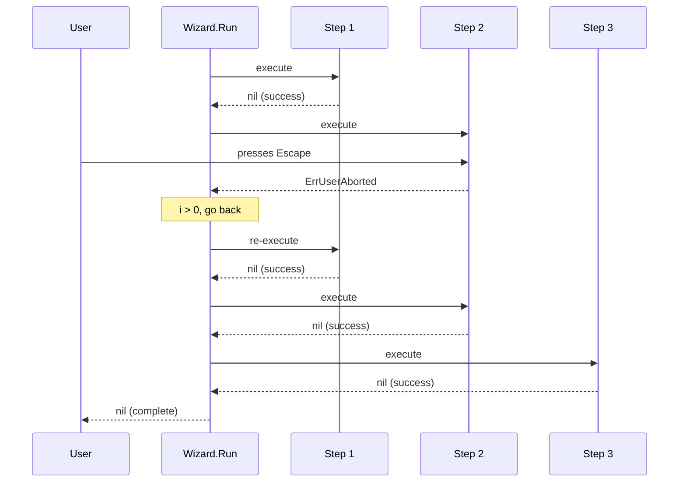

# Forms

The `forms` package provides reusable helpers for building multi-step interactive CLI forms on top of [charmbracelet/huh](https://github.com/charmbracelet/huh). It adds **Escape-to-go-back navigation** and a step runner that interprets abort signals as back navigation.

## Overview

When building CLI tools with `huh`, multi-step wizards (e.g. select an item, then configure its details) require calling `huh.NewForm().Run()` multiple times in sequence. This works well, but provides no way for the user to go back to a previous step if they make a mistake.

The `forms` package solves this by:

1. Binding the **Escape** key to the form's Quit action (alongside Ctrl+C)
2. Providing a **Wizard** struct that manages step sequencing and back-navigation state

The result is a natural navigation experience:

- **Escape** = go back to the previous step (or cancel if already on the first step)
- **Ctrl+C** = sends SIGINT which terminates the process immediately (hard cancel)

## API

### Wizard

`Wizard` is the primary API for building multi-step form flows. It manages step sequencing and Escape-to-go-back navigation internally.

```go
type Wizard struct { /* unexported fields */ }
```

#### NewWizard

Creates a Wizard. Pass `*huh.Group` arguments to seed it with static form steps — each group becomes one navigable form step. For a purely static flow, this is all you need:

```go
func NewWizard(groups ...*huh.Group) *Wizard
```

**Simple usage — static groups only:**

```go
import "github.com/phpboyscout/gtb/pkg/forms"

err := forms.NewWizard(
    huh.NewGroup(
        huh.NewSelect[string]().
            Title("Select type").
            Options(typeOptions...).
            Value(&itemType),
    ),
    huh.NewGroup(
        huh.NewInput().
            Title("Name").
            Value(&name),
    ),
).Run()
```

#### Group

Adds a step that displays one or more `huh.Group`s as a single navigable form. Use this for static form content that doesn't depend on earlier steps.

```go
func (w *Wizard) Group(groups ...*huh.Group) *Wizard
```

**Usage:**

```go
forms.NewWizard(selectGroup).
    Group(detailsGroup1, detailsGroup2).
    Run()
```

#### Step

Adds a custom step function for dynamic form logic, such as steps whose content depends on a previous selection or that need to perform setup before prompting.

```go
func (w *Wizard) Step(fn func() error) *Wizard
```

**Usage — mixed static and dynamic steps:**

```go
forms.NewWizard(
    huh.NewGroup(
        huh.NewSelect[string]().
            Title("Operation").
            Options(ops...).
            Value(&opName),
    ),
).Step(func() error {
    wizard := newSubWizardFor(opName)
    return wizard.Run()
}).Run()
```

#### Run

Executes all steps in order with back-navigation support. Escape goes back one step; abort on the first step propagates `huh.ErrUserAborted` to the caller.

```go
func (w *Wizard) Run() error
```

### NewNavigable

Creates a `huh.Form` with Escape bound to the Quit key. This is a drop-in replacement for `huh.NewForm()` and the building block used by `Wizard` internally. Use directly for single-step forms.

```go
func NewNavigable(groups ...*huh.Group) *huh.Form
```

**Usage:**

```go
err := forms.NewNavigable(
    huh.NewGroup(
        huh.NewInput().
            Title("Name").
            Value(&name),
    ),
).Run()
```

When the user presses Escape, `Run()` returns `huh.ErrUserAborted`. When the user presses Enter to submit, it returns `nil`.

### RunStepsWithBack

Lower-level function that executes a sequence of step functions with back navigation. Prefer `Wizard` for new code; this function is retained for backward compatibility.

```go
func RunStepsWithBack(steps []func() error) error
```

## Patterns

### Static multi-step wizard

The simplest case — each step is a static `huh.Group` passed directly to the constructor:

```go
err := forms.NewWizard(
    huh.NewGroup(
        huh.NewSelect[string]().
            Title("Select type").
            Options(
                huh.NewOption("Widget", "widget"),
                huh.NewOption("Gadget", "gadget"),
            ).
            Value(&w.itemType),
    ),
    huh.NewGroup(
        huh.NewInput().
            Title("Name").
            Value(&w.name),
    ),
).Run()
```

### Method references as steps

When steps live as methods on a struct (e.g. for hydration or dynamic group building), use `Step`:

```go
type createWizard struct {
    itemType string
    name     string
}

func (w *createWizard) promptType() error {
    return forms.NewNavigable(
        huh.NewGroup(
            huh.NewSelect[string]().
                Title("Select type").
                Options(typeOptions...).
                Value(&w.itemType),
        ),
    ).Run()
}

func (w *createWizard) promptName() error {
    return forms.NewNavigable(
        huh.NewGroup(
            huh.NewInput().
                Title(fmt.Sprintf("Name for %s", w.itemType)).
                Value(&w.name),
        ),
    ).Run()
}

func (w *createWizard) run() error {
    return forms.NewWizard().
        Step(w.promptType).
        Step(w.promptName).
        Run()
}
```

### Side effects between steps

When a step needs to perform setup before the next form is shown (e.g. hydrating values from a config file), place the setup logic inside the step:

```go
func (w *editWizard) run() error {
    return forms.NewWizard().
        Step(w.promptSelectItem).
        Step(w.promptEditDetails).
        Run()
}

func (w *editWizard) promptEditDetails() error {
    w.hydrateFromConfig() // runs each time we enter this step
    return forms.NewNavigable(
        huh.NewGroup(
            huh.NewInput().Title("Value").Value(&w.value),
        ),
    ).Run()
}
```

!!! tip
    Because the Wizard re-executes step functions when going back, any hydration or setup logic inside a step runs again on re-entry. This ensures the form always reflects the latest state.

### Mixed static and dynamic steps

Combine `NewWizard` constructor groups with `Step` for flows where some steps are static and others are dynamic:

```go
func orchestrate() error {
    var opName string
    var op Operation

    err := forms.NewWizard(
        huh.NewGroup(
            huh.NewSelect[string]().
                Title("Operation").
                Options(ops...).
                Value(&opName),
        ),
    ).Step(func() error {
        op = newOperationFor(opName)
        return op.promptDetails()
    }).Run()

    if err != nil {
        return err
    }

    return op.Execute()
}
```

### Conditional steps

Use the builder pattern to conditionally add steps:

```go
w := forms.NewWizard().
    Step(func() error {
        _, err := resolveType(opts)
        return err
    })

if !opts.SkipDetails {
    w.Step(func() error { return promptDetails(opts) })
}

return w.Run()
```

### Single-step forms

Single-step forms still benefit from `NewNavigable`. Escape on a single-step form returns `ErrUserAborted`, which a parent Wizard interprets as "go back":

```go
func (u *simpleUpdate) promptForm() error {
    return forms.NewNavigable(
        huh.NewGroup(
            huh.NewConfirm().Title("Enable feature?").Value(&u.enabled),
        ),
    ).Run()
}
```

## How it works



Internally, `NewNavigable` customises the `huh.KeyMap` to add `"esc"` to the Quit binding (alongside `"ctrl+c"`). When the user presses Escape, `huh` sets the form's state to aborted and `Run()` returns `huh.ErrUserAborted`.

`Wizard.Run` maintains a step index. On `ErrUserAborted`, it decrements the index (go back). On `nil`, it increments (go forward). On any other error, it returns immediately. If aborted on the first step (index 0), the error propagates to the caller.

## Best practices

- **Use `Wizard` for multi-step flows** — it manages state and navigation so you don't have to.
- **Use `NewWizard(groups...)` for static flows** — the constructor accepts groups directly, eliminating anonymous function boilerplate.
- **Use `Step` for dynamic logic** — when a step's content depends on a previous selection or needs hydration, `Step` gives you full control.
- **Always use `NewNavigable()` instead of `huh.NewForm()`** — even single-step forms benefit from Escape support when nested inside a Wizard.
- **Keep step functions idempotent** — they may be re-executed when the user navigates back and forward.
- **Place hydration logic inside the step function** so it runs on re-entry.
- **Use method references** (e.g. `w.Step(u.promptName)`) for readability when steps are struct methods.
