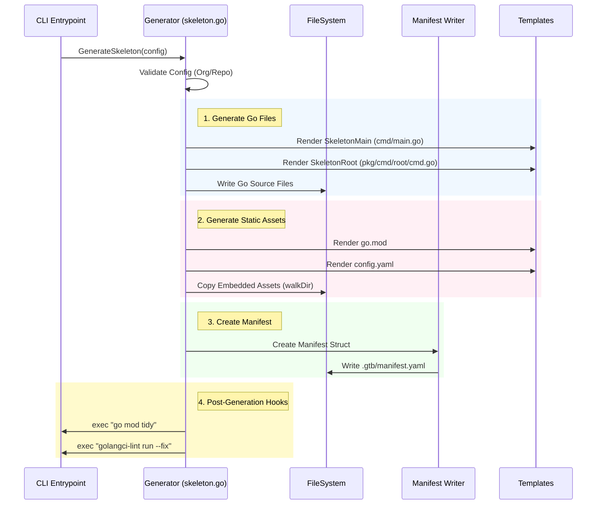
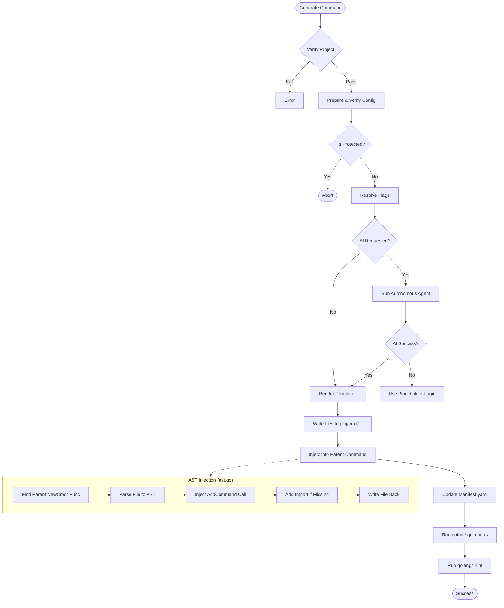

# Generator Package

The `internal/generator` package is the core engine responsible for all code generation, project scaffolding, and AST manipulation in `gtb`. This document provides a deep technical dive into the architecture for contributors.

## Project Creation Architecture (`skeleton.go`)

When a user runs `gtb generate skeleton`, the following flow executes to scaffold a new project.



### Key Implementation Details

-   **Jennifer & Templates**: We use a hybrid approach.
    -   `github.com/dave/jennifer` is used for generating complex Go files where imports need to be managed dynamically (though `skeleton.go` currently uses our own tempaltes).
    -   `text/template` is used for static boilerplate and config files.
-   **Asset Embed**: The `assets/skeleton` directory is embedded into the binary using `//go:embed`. This allows the CLI to operate as a single static binary without needing external resource files.

### Generated Files Reference

The following files are copied verbatim (or rendered as templates) from the embedded assets during `generate skeleton`:

#### Core Configuration
-   `.gitignore`: Standard Go ignore patterns.
-   `.golangci.yaml`: Strict linting configuration.
-   `.mockery.yml`: Mock generation config.
-   `Taskfile.yml`: Development task runner definitions.
-   `go.mod`: Go module definition (templated).

#### CI/CD & Automation (`.github/`)
-   `CODEOWNERS`: Default ownership rules.
-   `renovate.json5`: Dependency update configuration.
-   `workflows/lint.yaml`: CI linting checks.
-   `workflows/test.yaml`: CI unit tests with race detection.
-   `workflows/goreleaser.yaml`: Release automation.
-   `workflows/semantic-release.yaml`: Automated versioning.
-   `workflows/mkdocs.yaml`: Documentation publishing.

#### Documentation (`docs/`)
-   `mkdocs.yml`: Documentation site configuration (Material theme).
-   `docs/index.md`: Placeholder landing page.
-   `catalog-info.yaml`: Backstage catalog metadata.

## Command Generation Architecture (`commands.go`)

The command generation process is significantly more complex as it involves modifying existing code (AST manipulation) ensuring we don't break user logic.



## Detailed Responsibilities

1.  **Project Scaffolding**: Creating new directory structures for tools (`skeleton.go`).
2.  **Command Generation**: creating boilerplate (`cmd.go`) and implementation (`main.go`) files for new commands.
3.  **AST Manipulation**: Safely modifying existing Go source files to register commands, add flags, and inject imports (`ast.go`).
4.  **Manifest Management**: Reading, writing, and synchronizing the `.gtb/manifest.yaml` file (`manifest.go`).
5.  **AI Integration**: Orchestrating the conversion of natural language or scripts into Go code (`ai.go`).

## Key Components

### 1. The Generator Struct

The `Generator` struct is the main entry point for all generation operations. It holds the configuration context and dependencies.

```go
type Generator struct {
    config *Config       // Command-specific configuration (Name, Parent, Flags)
    props  *props.Props  // Global tool properties (Logger, FS)
}
```

Common entry points:

- `Generate(ctx)`: Orchestrates the generation of a new command.
- `Remove(ctx)`: Handles command removal and cleanup.
- `RegenerateProject(ctx)`: Rebuilds the entire CLI boilerplate from the manifest.

### 2. AST Manipulation (`ast.go`)

One of the most complex parts of the generator is safely editing existing Go code. We use the standard library `go/ast` (and `dave/dst` for better comment preservation) to parse, modify, and print Go code.

**The Injection Challenge:**
When adding a subcommand (e.g., `server start`), we must:

1.  Locate `pkg/cmd/server/cmd.go`.
2.  Find the `NewCmdServer` function.
3.  Find the variable declaration for the `cobra.Command`.
4.  Inject `cmd.AddCommand(start.NewCmdStart(props))` before the return statement.
5.  Add the import `.../pkg/cmd/server/start` to the file imports.

**Key Functions:**

- `AddCommandToParent`: Orchestrates the injection flow.
- `AddFlagToCommand`: Injects a flag definition (e.g., `cmd.Flags().StringVar...`) into a specific command's `NewCmd*` function.
- `AddImport`: Adds necessary imports only if they are missing, handling alias resolution.

**Design Principle:**
We strictly separate **Boilerplate** (generated, overwritable) from **Implementation** (user-owned).

- `cmd.go`: Fully owned by the generator. Can be blown away and recreated.
- `main.go`: Owned by the user. The generator only creates it if missing (or forced), and never modifies logic inside it (except via AI augmentation).

### 3. Manifest Management (`manifest.go`)

The `manifest.yaml` serves as the "Source of Truth" for the project structure. It maps the hierarchical relationships of commands that might be scattered across the filesystem.

**Structure:**
```yaml
commands:
  - name: server
    description: Start the server
    commands:
      - name: start
        description: Start the service
        flags:
          - name: port
            type: int
```

The generator ensures that filesystem changes (creating a folder) are always reflected in the manifest, and vice-versa (removing from manifest removes the folder).

### 4. Templating (`templates/`)

We use Go's `text/template` engine to render code. Templates are stored as string constants (or embedded files) to ensure the binary is self-contained.

- `command.go.tmpl`: The registration boilerplate.
- `main.go.tmpl`: The implementation stub.
- `main_test.go.tmpl`: Unit test scaffolding.

## Development Workflows

### Adding a New Flag Type

1.  Update `internal/generator/manifest.go` to support the new type in the `ManifestFlag` struct.
2.  Update `internal/generator/templates/command.go` to map the type to the corresponding Cobra method ( e.g., `Flags().DurationVar`).
3.  Update `internal/generator/ast.go` if the flag needs to be injectable into existing ASTs (complex types might need special handling).

### Debugging AST Issues

If the generator fails to modify a file correctly:

1.  Enable debug logging: `go run main.go --debug ...`
2.  Inspect the `ast.go` logic. The most common issues are:
    -   Target function not found (naming mismatch).
    -   Import aliases interfering with type resolution.
    -   Syntax errors in the source file preventing parsing.

## Testing

The generator relies heavily on **integration tests** that simulate a real filesystem using `afero.MemMapFs`.

```go
func TestGenerateCommand(t *testing.T) {
    // Setup in-memory FS
    fs := afero.NewMemMapFs()

    // Run generator
    g := NewGenerator(fs, config)
    err := g.Generate(ctx)

    // Assert file existence and content
    assert.NoError(t, err)
    exists, _ := afero.Exists(fs, "pkg/cmd/mycmd/cmd.go")
    assert.True(t, exists)
}
```
