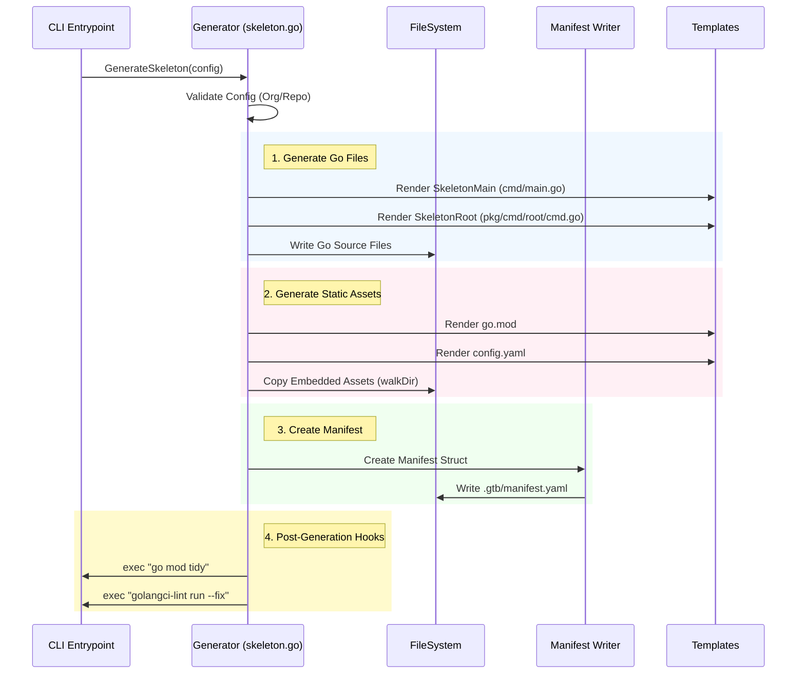
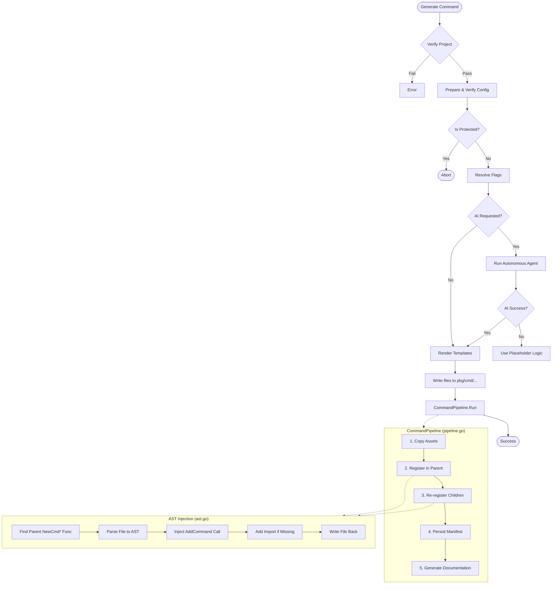

# Generator Package

The `internal/generator` package is the core engine responsible for all code generation, project scaffolding, and AST manipulation in `gtb`. This document provides a deep technical dive into the architecture for contributors.

## Project Creation Architecture (`skeleton.go`)

When a user runs `gtb generate skeleton`, the following flow executes to scaffold a new project.



### Key Implementation Details

-   **Jennifer & Templates**: We use a hybrid approach.
    -   `github.com/dave/jennifer` is used for generating complex Go files where imports need to be managed dynamically (though `skeleton.go` currently uses our own tempaltes).
    -   `text/template` is used for static boilerplate and config files.
-   **Asset Embed**: The `assets/skeleton`, `assets/skeleton-github`, and `assets/skeleton-gitlab` directories are all embedded into the binary using `//go:embed`. The common assets in `assets/skeleton` are always applied; VCS-specific assets (`skeleton-github` or `skeleton-gitlab`) are selected based on the `--git-backend` flag. This allows the CLI to operate as a single static binary without needing external resource files.

### Generated Files Reference

The following files are copied verbatim (or rendered as templates) from the embedded assets during `generate skeleton`:

#### Core Configuration
-   `.gitignore`: Standard Go ignore patterns.
-   `.golangci.yaml`: Strict linting configuration.
-   `.mockery.yml`: Mock generation config.
-   `justfile`: Development task runner definitions (replaces the legacy `Taskfile.yml`).
-   `go.mod`: Go module definition (templated).

#### CI/CD & Automation (`.github/`)
-   `CODEOWNERS`: Default ownership rules.
-   `renovate.json5`: Dependency update configuration.
-   `workflows/lint.yaml`: CI linting checks.
-   `workflows/test.yaml`: CI unit tests with race detection.
-   `workflows/goreleaser.yaml`: Release automation.
-   `workflows/semantic-release.yaml`: Automated versioning.
-   `workflows/docs.yaml`: Documentation publishing (GitHub) or `.gitlab/ci/pages.yml` (GitLab).

#### Documentation (`docs/`)
-   `zensical.toml`: Documentation site configuration (Zensical/MkDocs-Material).
-   `docs/index.md`: Placeholder landing page.

## Command Generation Architecture

The command generation process is significantly more complex as it involves modifying existing code (AST manipulation) ensuring we don't break user logic. The post-generation steps are encapsulated in `CommandPipeline` (`pipeline.go`).



## Detailed Responsibilities

1.  **Project Scaffolding**: Creating new directory structures for tools (`skeleton.go`).
2.  **Command Generation**: creating boilerplate (`cmd.go`) and implementation (`main.go`) files for new commands (`commands.go`).
3.  **Post-generation Pipeline**: Sequencing the five ordered post-generation steps (assets, parent registration, child re-registration, manifest persistence, documentation) via `CommandPipeline` (`pipeline.go`).
4.  **AST Manipulation**: Safely modifying existing Go source files to register commands, add flags, and inject imports (`ast.go`).
5.  **Manifest Management**: Reading, writing, and synchronizing the `.gtb/manifest.yaml` file; `ManifestCommandUpdate` provides a structured API for manifest mutations (`manifest_update.go`, `manifest_io.go`, `manifest_hash.go`).
6.  **Project Regeneration**: Rebuilding all boilerplate from the manifest, including child command re-registration and full propagation of help-channel configuration (`regenerate.go`).
7.  **AI Integration**: Orchestrating the conversion of natural language or scripts into Go code (`ai.go`).

## Key Components

### 1. The Generator Struct

The `Generator` struct is the main entry point for all generation operations. It holds the configuration context and dependencies.

```go
type Generator struct {
    config *Config       // Command-specific configuration (Name, Parent, Flags)
    props  *props.Props  // Global tool properties (Logger, FS)
}
```

Common entry points:

- `Generate(ctx)`: Orchestrates the generation of a new command.
- `Remove(ctx)`: Handles command removal and cleanup.
- `RegenerateProject(ctx)`: Rebuilds the entire CLI boilerplate from the manifest.

### 2. CommandPipeline (`pipeline.go`)

`CommandPipeline` owns the five ordered steps that run after every `cmd.go` is written. It is constructed via `newCommandPipeline(g, PipelineOptions{})` and its behaviour can be tuned with `PipelineOptions`:

```go
type PipelineOptions struct {
    SkipAssets        bool
    SkipRegistration  bool
    SkipDocumentation bool
}
```

Steps:

| # | Step | What it does |
|---|------|-------------|
| 1 | Copy Assets | Copies any embedded static assets for the command. |
| 2 | Register in Parent | Calls `AddCommandToParent` to inject `cmd.AddCommand(...)` into the parent's `cmd.go`. |
| 3 | Re-register Children | Reads the manifest to find existing child commands and re-injects their `AddCommand` calls. This preserves child registrations when a parent command is overwritten. |
| 4 | Persist Manifest | Calls `updateManifest` with a `ManifestCommandUpdate` to write hashes and metadata. |
| 5 | Generate Docs | Invokes the AI documentation helper (or skips if a doc file already exists). |

Non-fatal step failures are returned as `StepWarning` values inside `PipelineResult` rather than aborting the pipeline.

### 3. CommandContext (`context.go`)

`CommandContext` is a value type that captures the fully-resolved name, parent path, and import path for a command. `buildCommandContext` is the sole factory:

```go
ctx := buildCommandContext(g, childName, parentDir)
childCfg := ctx.ToConfig()
```

`reRegisterChildCommands` (step 3 above) uses `buildCommandContext` to construct a child generator with the correct package and import path before calling `AddCommandToParent`.

### 4. AST Manipulation (`ast.go`)

One of the most complex parts of the generator is safely editing existing Go code. We use the standard library `go/ast` (and `dave/dst` for better comment preservation) to parse, modify, and print Go code.

**The Injection Challenge:**
When adding a subcommand (e.g., `server start`), we must:

1.  Locate `pkg/cmd/server/cmd.go`.
2.  Find the `NewCmdServer` function.
3.  Find the variable declaration for the `cobra.Command`.
4.  Inject `cmd.AddCommand(start.NewCmdStart(props))` before the return statement.
5.  Add the import `.../pkg/cmd/server/start` to the file imports.

**Key Functions:**

- `AddCommandToParent`: Orchestrates the injection flow.
- `AddFlagToCommand`: Injects a flag definition (e.g., `cmd.Flags().StringVar...`) into a specific command's `NewCmd*` function.
- `AddImport`: Adds necessary imports only if they are missing, handling alias resolution.

**Design Principle:**
We strictly separate **Boilerplate** (generated, overwritable) from **Implementation** (user-owned).

- `cmd.go`: Fully owned by the generator. Can be blown away and recreated.
- `main.go`: Owned by the user. The generator only creates it if missing (or forced), and never modifies logic inside it (except via AI augmentation).

### 5. Manifest Management

The `manifest.yaml` serves as the "Source of Truth" for the project structure. It maps the hierarchical relationships of commands that might be scattered across the filesystem.

**Structure:**
```yaml
commands:
  - name: server
    description: Start the server
    commands:
      - name: start
        description: Start the service
        flags:
          - name: port
            type: int
```

The generator ensures that filesystem changes (creating a folder) are always reflected in the manifest, and vice-versa (removing from manifest removes the folder).

Manifest mutations use the `ManifestCommandUpdate` struct (`manifest_update.go`) rather than positional parameters, making call sites self-documenting:

```go
type ManifestCommandUpdate struct {
    Name, Description, LongDescription string
    Aliases    []string
    Args       string
    Hashes     map[string]string
    Flags      []ManifestFlag
    WithAssets, WithInitializer bool
    PersistentPreRun, PreRun    bool
    Protected  *bool
    Hidden     bool
}
```

Manifest file I/O lives in `manifest_io.go`; hash calculation in `manifest_hash.go`.

### 6. Regeneration (`regenerate.go`)

`RegenerateProject` reads the manifest and rebuilds all boilerplate. The root command is handled by `regenerateRootCommand`, which delegates field mapping to `buildSkeletonRootData`:

```go
func buildSkeletonRootData(m Manifest, subcommands []templates.SkeletonSubcommand) templates.SkeletonRootData
```

This function is the single source of truth for mapping manifest fields — including the full `ManifestHelp` struct (help type, Slack channel/team, Teams channel/team) — to `SkeletonRootData`. Keeping this mapping in one place prevents settings from being silently dropped when the root command is regenerated.

Each non-root command is handled by `regenerateCommandRecursive`, which calls through `performGeneration` → `postGenerate` → `CommandPipeline.Run` with `SkipRegistration: true` (children re-register themselves in step 3 of the pipeline).

### 7. Templating (`templates/`)

We use Go's `text/template` engine to render code. Templates are stored as string constants (or embedded files) to ensure the binary is self-contained.

- `command.go.tmpl`: The registration boilerplate.
- `main.go.tmpl`: The implementation stub.
- `main_test.go.tmpl`: Unit test scaffolding.

## Development Workflows

### Adding a New Flag Type

1.  Update `internal/generator/manifest.go` to support the new type in the `ManifestFlag` struct.
2.  Update `internal/generator/manifest_update.go` if the new type affects the `ManifestCommandUpdate` struct or `updateCommandRecursive` logic.
3.  Update `internal/generator/templates/command.go` to map the type to the corresponding Cobra method (e.g., `Flags().DurationVar`).
4.  Update `internal/generator/ast.go` if the flag needs to be injectable into existing ASTs (complex types might need special handling).

### Debugging AST Issues

If the generator fails to modify a file correctly:

1.  Enable debug logging: `go run main.go --debug ...`
2.  Inspect the `ast.go` logic. The most common issues are:
    -   Target function not found (naming mismatch).
    -   Import aliases interfering with type resolution.
    -   Syntax errors in the source file preventing parsing.

## Testing

The generator relies heavily on **integration tests** that simulate a real filesystem using `afero.MemMapFs`.

The `pipeline_test.go` file provides two shared helpers:

- `setupTestProject(t, path)` — scaffolds a minimal in-memory project via `GenerateSkeleton` with a mocked `runCommand` and a `config.NewFilesContainer` so AI config resolution does not panic.
- `generateCmd(t, p, path, name, parent)` — pre-creates a doc stub at the correct nested path (e.g. `docs/commands/start/stop/index.md`) before calling `Generate`. This prevents `handleDocumentationGeneration` from making live AI API calls that would hang tests.

```go
func TestGenerateCommand(t *testing.T) {
    t.Setenv("GTB_NON_INTERACTIVE", "true")

    path := "/work"
    p := setupTestProject(t, path)

    generateCmd(t, p, path, "mycmd", "root")

    exists, _ := afero.Exists(p.FS, filepath.Join(path, "pkg/cmd/mycmd/cmd.go"))
    assert.True(t, exists)
}
```

### Key Test Files

| File | Purpose |
|---|---|
| `pipeline_test.go` | `CommandPipeline` behaviour, child re-registration, `SkipRegistration`, manifest hash consistency |
| `regenerate_test.go` | End-to-end `RegenerateProject` including help config preservation |
| `recursive_test.go` | `ManifestCommandUpdate` round-trips via `updateCommandRecursive` |
| `ast_test.go` | AST injection correctness |
