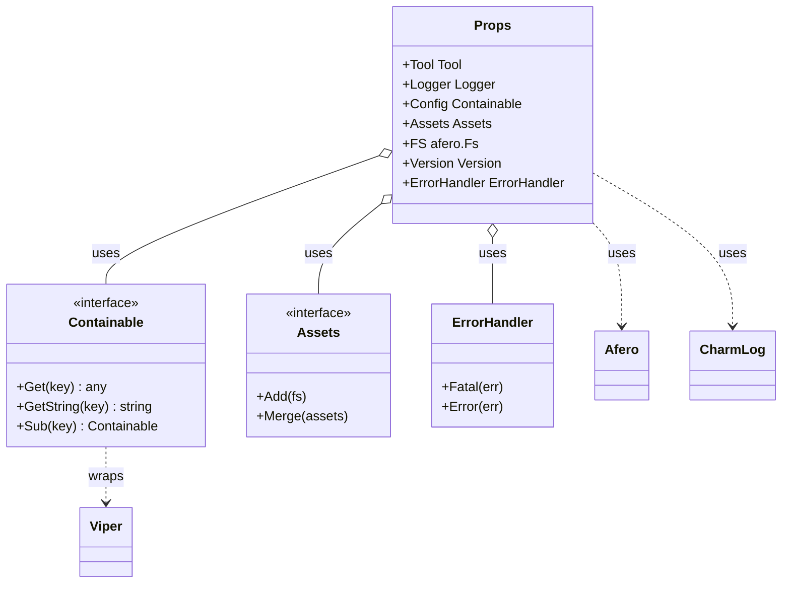
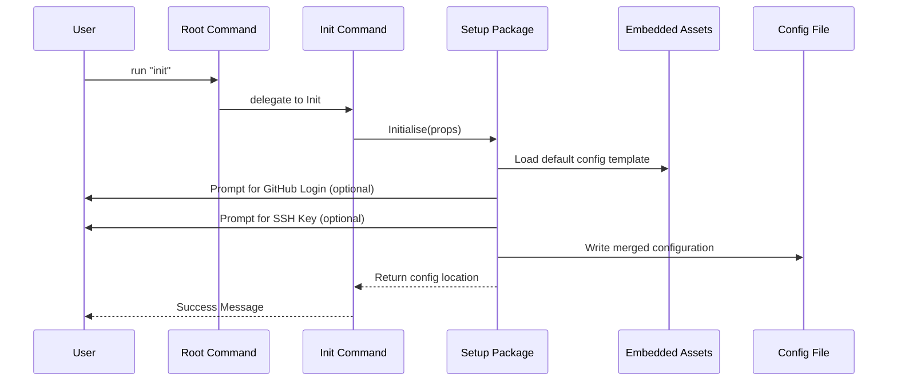

# Architectural Overview

This guide provides a high-level view of how the various components of GTB interact to create a cohesive CLI framework.

## Component Relationships

At the heart of every GTB application is the `Props` container, which orchestrates the primary services. The following diagram illustrates the relationships between these core components:

## Core Workflows

### 1. Application Initialization

When a user runs the `init` command, the framework performs a multi-stage bootstrapping process:

### 2. Dependency Injection Flow

Dependencies are injected from the entry point (`main.go`) through the `Props` struct:

1.  **Creation**: `Props` is instantiated with the basic environment (Logger, Version).
2.  **Configuration**: The `config` package loads settings into `Props.Config`.
3.  **Command Wiring**: Subcommands are created with a reference to `Props`, giving them immediate access to all services.
4.  **Execution**: Commands use `Props.ErrorHandler` to ensure consistent terminal output and exit codes.

## Design Principles

*   **Explicit over Implicit**: We prefer passing `Props` over using `context.Context` for dependencies (see [Props documentation](../components/props.md) for the rationale).
*   **Interface Segregation**: Core services (Config, Assets, VCS) are defined by interfaces to enable clean mocking in unit tests.
*   **Consistent Error Handling**: All user-facing errors funnel through the `ErrorHandler` to maintain a unified look and feel.
