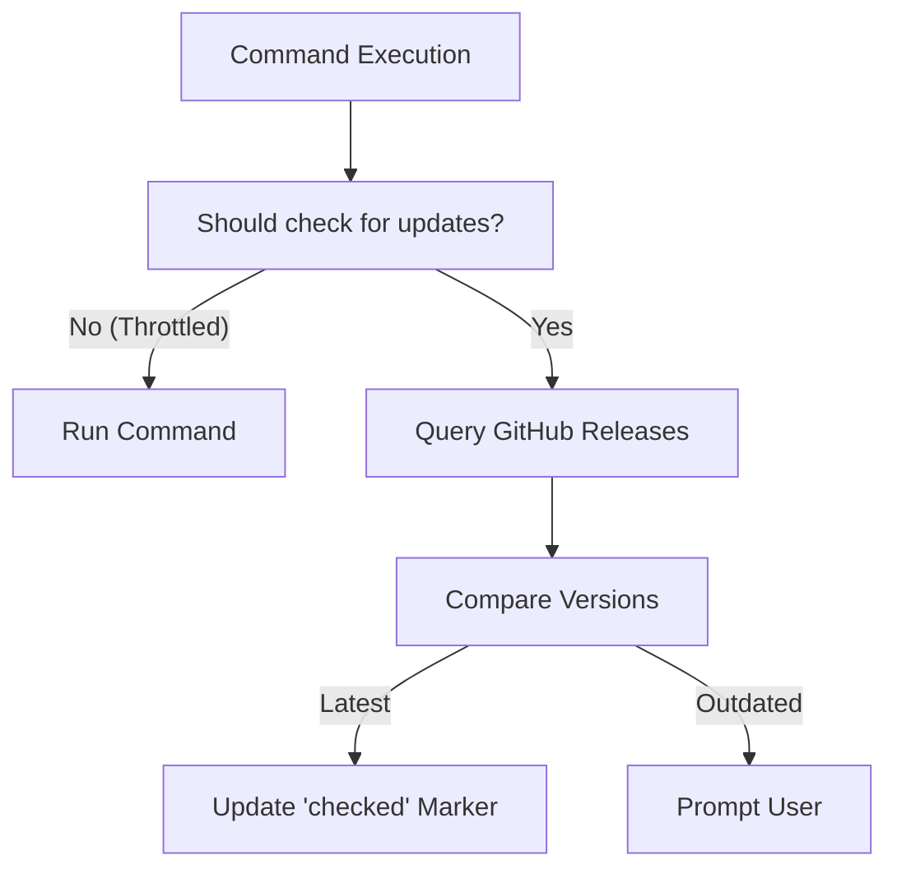

# Auto-Update Lifecycle

GTB includes a robust self-update mechanism that ensures users are always running the latest version of your tool without manual intervention. This system balances user convenience with operational stability.

## The Self-Update Workflow

The update process is typically split into two stages: **Discovery** and **Execution**.

### 1. Discovery (The Throttled Check)

To prevent overwhelming GitHub APIs and slowing down CLI usage, update checks are throttled using a file-based marker system.

- **Markers**: Status files (e.g., `last_checked`) are stored in the tool's config directory.
- **Throttling**: By default, checks occur at most once every 24 hours.

### 2. Execution (Atomic Installation)

When an update is triggered, the `SelfUpdater` performs an atomic replacement of the running binary. This "bait and switch" approach is technically necessary because most filesystems (particularly Windows, but also many Unix-based systems) prevent writing to or deleting a binary file while it is actively being executed by the operating system.

The installation follows these steps to bypass this limitation:

1.  **Download**: The platform-specific `.tar.gz` asset is downloaded into memory.
2.  **Extract**: The binary is extracted from the archive.
3.  **Temp Buffer**: The new binary is written to a temporary file (e.g., `als_`) in the same directory as the current executable.
4.  **Swap**: The temporary file is renamed to the target filename (overwriting the old one), and permissions are set.

By writing to a temporary file first and then performing a rename, we ensure that the update is atomic—either it succeeds completely, or the old binary remains untouched.

## Key Components

### `SelfUpdater`
The core engine (`pkg/setup/update.go`) that communicates with GitHub, compares semantic versions, and manages the local filesystem during the update.

### `IsLatestVersion`
A utility that handles the logic of comparing the `CurrentVersion` (compiled into the binary) against the latest GitHub release. It handles edge cases like "future" versions or development builds.

## Testability via Abstraction

The update system is designed to be fully testable despite its heavy reliance on the network and filesystem:
- **`vcs.GitHubClient`**: Injected to mock API responses.
- **`afero.Fs`**: Used for all filesystem operations, allowing the entire download/extract/swap flow to be verified in-memory.

## Best Practices

- **Explicit Update Command**: Always provide an `update` command (via `setup.Register`) for users who want to force a sync manually.
- **Developer Safeguards**: The updater detects development versions (e.g., `v0.0.0`) and prompts for a `--force` flag to avoid accidental overrides of local builds.
