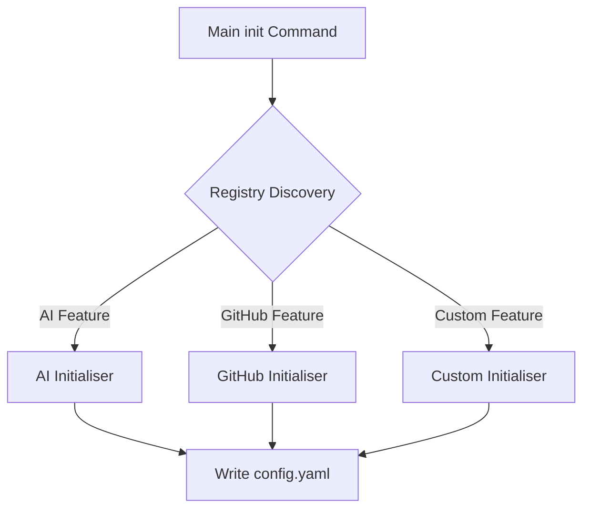

# Tool Initialisers

Initialisers are a core architectural pattern in GTB used to manage the configuration and bootstrapping of individual tool features in a decoupled, modular way.

## Purpose: Configuration, Not Logic

It is important to distinguish between **Configuration Initialisation** and **Functional Initialisation**:

- **Initialisers** are exclusively for ensuring that the `config.yaml` contains the necessary values (tokens, paths, preferences) for a feature to operate. This often involves interactive prompts, environment variable checks, or asset mounting.
- **Functional Initialisation** (the actual logic of how a feature behaves) remains firmly within your `NewCmd*` constructor and the `cobra.Command` execution logic.

In short: Initialisers prepare the *data* so that your *commands* can run.

## The Problem

Traditional CLI tools often have a monolithic `init` command that hardcodes every possible configuration step. This results in:

- **Brittle Code**: Adding a new feature requires modifying the core `init` command logic.
- **Bloated Binaries**: Features that aren't enabled for a specific project still carry their initialization logic.
- **Complex UI**: The `init --help` output becomes overwhelming with flags for features the user may not even be using.

## The Initialiser Solution

GTB solves this through **Self-Registering Initialisers**. Instead of the `init` command knowing about features, the features "tell" the framework how they want to be initialised and what flags they need.

### The Initialiser Interface

Any component that requires an interactive setup step (like a login or an API key input) implements the `Initialiser` interface:

```go
type Initialiser interface {
    // Name returns a human-readable name for logging.
    Name() string
    // IsConfigured returns true if the feature's config is already present.
    IsConfigured(cfg config.Containable) bool
    // Configure runs the interactive setup and writes values into the config.
    Configure(props *props.Props, cfg config.Containable) error
}
```

### Self-Registration

Features register themselves with the framework during package `init()`. This allows the main `initialise` command to discover them dynamically based on what's enabled in the local tool's `props`.

A feature can register three things:

1. **Initialisers**: Logic to check and perform setup. These are executed by the main `init` command if the feature is enabled and not yet configured.
2. **Subcommands**: Standalone `init <feature>` commands. These are intended for **forced reconfiguration**. While the root `init` command will skip a feature if it's already configured, running the specific subcommand (e.g., `als init ai`) will trigger the setup process regardless of the current state.
3. **Flags**: Feature-specific flags (like `--skip-ai`) added to the main `init` command.



## How it works at Runtime

1. When you run `als init`, the framework fetches all registered items from the **Global Setup Registry**.
2. It filters these items based on `props.Tool.IsEnabled(feature)`.
3. It dynamically attaches any registered **Flags** to the `init` command.
4. During execution, it iterates through the **Initialisers**. If `IsConfigured()` returns false (and the feature isn't explicitly skipped via a flag), it calls `Configure()`.
5. Finally, it merges any default assets provided by the feature and writes the final configuration to disk.

---

!!! note
    Initialisers are designed to be "aware" of the environment. For example, they can check if a specific environment variable override exists and skip interactive prompts automatically if a value is already provided.
