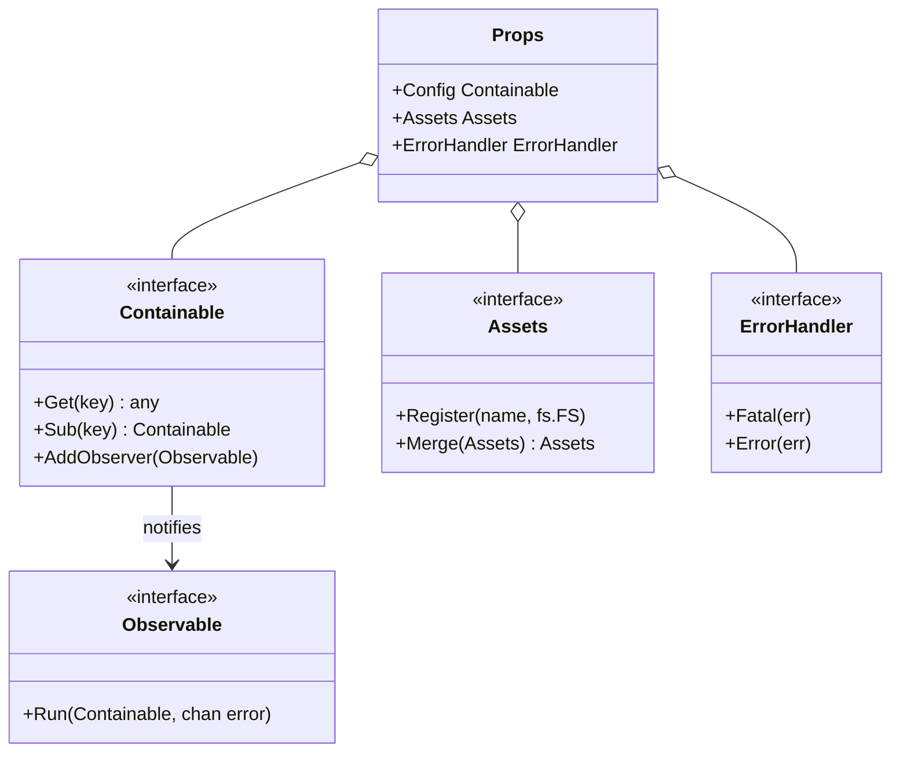

# Interface Design

GTB follows Go's interface design principles: small, focused interfaces that enable flexible composition, dependency injection, and comprehensive testing. This guide provides a complete reference to all public interfaces in the framework.

## Design Philosophy

GTB interfaces follow these key principles:

**Interface Segregation**
:   Interfaces are kept small and focused on specific behaviours rather than encompassing all possible methods.

**Accept Interfaces, Return Structs**
:   Functions accept interface parameters for flexibility but return concrete types for clarity.

**Consumer-Defined Interfaces**
:   Interfaces are defined where they're consumed, not where they're implemented, following Go idioms.

**Testing First**
:   All interfaces are designed with testability in mind, enabling mock implementations via Mockery.

---

## Interface Reference

### Configuration Interfaces

#### Containable

**Package:** `pkg/config`  
**Purpose:** Abstract configuration access, enabling testing without real config files.

```go
type Containable interface {
    Get(key string) any
    GetBool(key string) bool
    GetInt(key string) int
    GetFloat(key string) float64
    GetString(key string) string
    GetTime(key string) time.Time
    GetDuration(key string) time.Duration
    GetViper() *viper.Viper
    Has(key string) bool
    IsSet(key string) bool
    Set(key string, value any)
    WriteConfigAs(dest string) error
    Sub(key string) Containable
    AddObserver(o Observable)
    AddObserverFunc(f func(Containable, chan error))
    ToJSON() string
    Dump()
}
```

**Primary Implementation:** `*Container`

**Key Design Decisions:**

- Wraps `viper.Viper` to provide a testable abstraction
- `Sub(key)` returns another `Containable`, enabling hierarchical config access
- Observer pattern built in for configuration hot-reload

**Usage Example:**

```go
func loadDatabaseConfig(cfg config.Containable) (*DatabaseConfig, error) {
    db := cfg.Sub("database")
    return &DatabaseConfig{
        Host:    db.GetString("host"),
        Port:    db.GetInt("port"),
        Timeout: db.GetDuration("timeout"),
    }, nil
}
```

---

#### Observable

**Package:** `pkg/config`  
**Purpose:** Configuration change notification callback.

```go
type Observable interface {
    Run(Containable, chan error)
}
```

**Primary Implementation:** `Observer` struct with handler function

**Usage Example:**

```go
type ConfigReloader struct {
    service *MyService
}

func (r *ConfigReloader) Run(cfg config.Containable, errs chan error) {
    if err := r.service.Reconfigure(cfg); err != nil {
        errs <- err
    }
}

container.AddObserver(&ConfigReloader{service: myService})
```

---

### Asset Management

#### Assets

**Package:** `pkg/props`  
**Purpose:** Unified access to embedded filesystems with automatic merging.

```go
type Assets interface {
    fs.FS
    fs.ReadDirFS
    fs.GlobFS
    fs.StatFS
    
    Slice() []fs.FS
    Names() []string
    Get(name string) fs.FS
    Register(name string, fs fs.FS)
    For(names ...string) Assets
    Merge(others ...Assets) Assets
    Exists(name string) (fs.FS, error)
    Mount(f fs.FS, prefix string)
}
```

**Primary Implementation:** `*embeddedAssets`

**Key Design Decisions:**

- Composes standard library `fs.*` interfaces for compatibility
- Named registration enables selective asset access
- Automatic YAML/JSON/CSV merging across registered filesystems

**Usage Example:**

```go
// Register assets from multiple packages
p.Assets.Register("core", &coreAssets)
p.Assets.Register("myfeature", &featureAssets)

// Access merged configuration
file, err := p.Assets.Open("config.yaml")  // Merges all config.yaml files

// Access specific asset set
docs := p.Assets.For("core")  // Only core assets
```

---

### Error Handling

#### ErrorHandler

**Package:** `pkg/errorhandling`  
**Purpose:** Centralised error processing with logging, help display, and exit handling.

```go
type ErrorHandler interface {
    Check(err error, prefix string, level string, cmd ...*cobra.Command)
    Fatal(err error, prefixes ...string)
    Error(err error, prefixes ...string)
    Warn(err error, prefixes ...string)
    SetUsage(usage func() error)
}
```

**Primary Implementation:** `*StandardErrorHandler`

**Key Design Decisions:**

- Separates error logging from exit behaviour (testable)
- Supports multiple severity levels
- Integrates rich stack traces, hints, and details via `cockroachdb/errors`

**Usage Example:**

```go
func myCommand(p *props.Props) *cobra.Command {
    return &cobra.Command{
        Run: func(cmd *cobra.Command, args []string) {
            err := doWork(args)
            p.ErrorHandler.Fatal(err)  // Logs and exits if err != nil
        },
    }
}
```

---

### AI Integration

#### ChatClient

**Package:** `pkg/chat`  
**Purpose:** Unified interface for AI provider interactions.

```go
type ChatClient interface {
    Add(prompt string) error
    Ask(question string, target any) error
    SetTools(tools []Tool) error
    Chat(ctx context.Context, prompt string) (string, error)
}
```

**Implementations:** OpenAI, Claude, and Gemini clients (internal)

**Key Design Decisions:**

- Provider-agnostic interface hides API differences
- Tool calling abstraction enables agentic workflows
- `Ask` supports structured JSON responses

**Usage Example:**

```go
type Analysis struct {
    Issues []string `json:"issues"`
    Score  int      `json:"score"`
}

client, _ := chat.New(ctx, props, chat.Config{Provider: chat.ProviderClaude})
var result Analysis
client.Ask("Analyse this code for issues", &result)
```

---

### Service Lifecycle

#### Controllable

**Package:** `pkg/controls`  
**Purpose:** Manage multiple concurrent services with coordinated lifecycle.

```go
type Controllable interface {
    Messages() chan Message
    Health() chan HealthMessage
    Errors() chan error
    Signals() chan os.Signal
    SetErrorsChannel(errs chan error)
    SetMessageChannel(control chan Message)
    SetSignalsChannel(sigs chan os.Signal)
    SetHealthChannel(health chan HealthMessage)
    SetWaitGroup(wg *sync.WaitGroup)
    Start()
    Stop()
    GetContext() context.Context
    SetState(state State)
    GetState() State
    SetLogger(logger *slog.Logger)
    GetLogger() *slog.Logger
    IsRunning() bool
    IsStopped() bool
    IsStopping() bool
    Register(id string, start StartFunc, stop StopFunc, status StatusFunc)
}
```

**Primary Implementation:** `*Controller`

**Key Design Decisions:**

- Shared channels for inter-service communication
- State machine for lifecycle tracking (`Unknown → Running → Stopping → Stopped`)
- Built-in OS signal handling for graceful shutdown

---

### Version Control

#### RepoLike

**Package:** `pkg/vcs`  
**Purpose:** Abstract Git repository operations for local and in-memory repos.

```go
type RepoLike interface {
    SourceIs(int) bool
    SetSource(int)
    SetRepo(*git.Repository)
    GetRepo() *git.Repository
    SetKey(*ssh.PublicKeys)
    SetBasicAuth(string, string)
    GetAuth() transport.AuthMethod
    SetTree(*git.Worktree)
    GetTree() *git.Worktree
    Checkout(plumbing.ReferenceName) error
    CheckoutCommit(plumbing.Hash) error
    CreateBranch(string) error
    OpenInMemory(string, string, ...CloneOption) (*git.Repository, *git.Worktree, error)
    OpenLocal(string, string) (*git.Repository, *git.Worktree, error)
    Open(RepoType, string, string, ...CloneOption) (*git.Repository, *git.Worktree, error)
    WalkTree(func(*object.File) error) error
    AddToFS(fs afero.Fs, gitFile *object.File, fullPath string) error
}
```

**Primary Implementation:** `*Repo`

**Key Design Decisions:**

- Polymorphic switching between local filesystem and in-memory storage
- Functional options for clone configuration
- Integration with `afero.Fs` for test isolation

---

#### GitHubClient

**Package:** `pkg/vcs`  
**Purpose:** GitHub Enterprise API operations.

```go
type GitHubClient interface {
    GetClient() *github.Client
    CreatePullRequest(ctx, owner, repo string, pull *github.NewPullRequest) (*github.PullRequest, error)
    GetPullRequestByBranch(ctx, owner, repo, branch, state string) (*github.PullRequest, error)
    AddLabelsToPullRequest(ctx, owner, repo string, number int, labels []string) error
    UpdatePullRequest(ctx, owner, repo string, number int, pull *github.PullRequest) (*github.PullRequest, *github.Response, error)
    CreateRepo(ctx, owner, slug string) (*github.Repository, error)
    UploadKey(ctx, name string, key []byte) error
    ListReleases(ctx, owner, repo string) ([]string, error)
    GetReleaseAssets(ctx, owner, repo, tag string) ([]*github.ReleaseAsset, error)
    GetReleaseAssetID(ctx, owner, repo, tag, assetName string) (int64, error)
    DownloadAsset(ctx, owner, repo string, assetID int64) (io.ReadCloser, error)
    DownloadAssetTo(ctx, fs afero.Fs, owner, repo string, assetID int64, filePath string) error
    GetFileContents(ctx, owner, repo, path, ref string) (string, error)
}
```

**Primary Implementation:** `*GHClient`

---

### Initialisation

#### Initialiser

**Package:** `pkg/setup`  
**Purpose:** Pluggable initialisation steps for CLI tools.

```go
type Initialiser interface {
    Name() string
    IsConfigured(cfg config.Containable) bool
    Configure(props *props.Props, cfg config.Containable) error
}
```

**Implementations:** GitHub initialiser, AI initialiser, custom feature initialisers

**Key Design Decisions:**

- Self-registration via feature registry
- Idempotent—checks existing config before prompting
- Decoupled from core init command logic

---

## Interface Relationships



---

## Testing with Interfaces

All interfaces have auto-generated mocks in `mocks/pkg/`:

```go
import (
    "testing"
    mocks_config "github.com/phpboyscout/gtb/mocks/pkg/config"
)

func TestMyFunction(t *testing.T) {
    mockCfg := &mocks_config.Containable{}
    mockCfg.On("GetString", "api.url").Return("http://test.example.com")
    mockCfg.On("GetInt", "api.timeout").Return(30)
    
    result := MyFunction(mockCfg)
    
    mockCfg.AssertExpectations(t)
}
```

### Generating Mocks

Mocks are generated using Mockery. After adding a new interface:

```bash
task mocks  # or: mockery
```

---

## Creating New Interfaces

When designing new interfaces for your GTB application:

### 1. Keep Interfaces Small

```go
// ✓ Good: Focused interface
type Reader interface {
    Read(key string) ([]byte, error)
}

// ✗ Avoid: Kitchen sink interface
type DataStore interface {
    Read(key string) ([]byte, error)
    Write(key string, data []byte) error
    Delete(key string) error
    List(prefix string) ([]string, error)
    Watch(key string, callback func([]byte)) error
    Transaction(func(tx Tx) error) error
    // ... many more methods
}
```

### 2. Define Where Consumed

```go
// Define interface in the package that uses it
package mycommand

// FileReader is what mycommand needs to read files
type FileReader interface {
    ReadFile(path string) ([]byte, error)
}

func NewCommand(reader FileReader) *cobra.Command {
    // ...
}
```

### 3. Accept Interfaces, Return Structs

```go
// ✓ Good: Accept interface, return concrete
func NewService(cfg config.Containable) *MyService {
    return &MyService{cfg: cfg}
}

// ✗ Avoid: Returning interface hides implementation
func NewService(cfg config.Containable) ServiceInterface {
    return &MyService{cfg: cfg}
}
```

---

## Related Documentation

- **[Props Container](props.md)**: How interfaces compose in the central dependency container
- **[Mocks Package](../components/mocks.md)**: Using generated mocks for testing
- **[Error Handling](error-handling.md)**: ErrorHandler interface patterns
- **[Configuration](config.md)**: Containable and Observable usage
