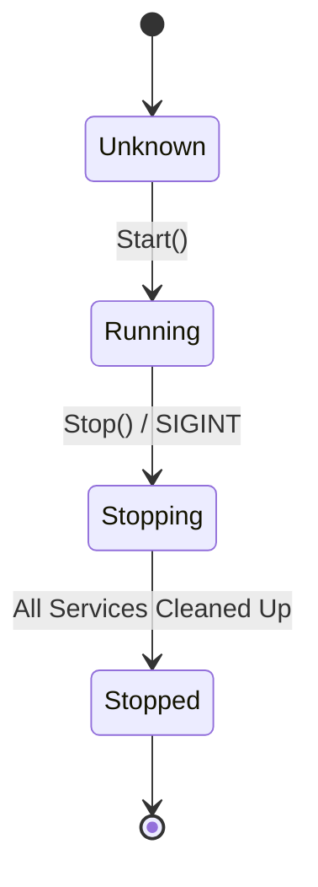

# Service Orchestration & Control

The `pkg/controls` package provides a standardized way to manage long-running background services. It handles the complexities of concurrent execution, health monitoring, and graceful shutdowns, ensuring that your CLI application remains stable and responsive.

## The Controller Pattern

The `Controller` is the central orchestrator that manages a collection of `Services`. It abstracts away the manual management of goroutines, wait groups, and signal handling.

### Key Components

- **`Controllable` Interface**: Defines the contract for any component that can be managed by the controller.
- **`Service` Struct**: A simple wrapper around three primary lifecycle functions: `Start`, `Stop`, and `Status`.
- **Channels**: The "nervous system" of the controller, using typed channels for:
    - **`Messages`**: Processing control signals (e.g., `Stop`, `Status`).
    - **`Health`**: Streaming host/port status and heartbeat messages.
    - **`Errors`**: Centralized reporting of background service failures.
    - **`Signals`**: Handling OS-level signals like `SIGINT` and `SIGTERM`.

## Specialized Server Controls

For common server types, GTB provides specialized sub-packages that simplify integration:

- **`pkg/controls/http`**: Standardized HTTP/TLS server with production timeouts and security defaults.
- **`pkg/controls/grpc`**: Standardized gRPC server with reflection support.

These packages provide `Start` and `Stop` functions that return the `StartFunc` and `StopFunc` types required by the `Controller.Register` method.

## Lifecycle Management

The `Controller` manages a service's state through a clean lifecycle flow:

### Graceful Shutdown

Handling shutdowns correctly is critical, especially when services hold file locks or open network connections. The controller handles this through two primary triggers:

1.  **OS Signals**: Automatically traps `SIGINT` and `SIGTERM` to initiate a stop sequence.
2.  **Context Cancellation**: Listens to the parent `context.Context` and triggers a shutdown if the context is cancelled.

When a stop is triggered, the controller iterates through all registered services and calls their `Stop()` functions before waiting for all goroutines to finish via a `sync.WaitGroup`.

## State & Thread Safety

To prevent race conditions during lifecycle transitions, the `Controller` uses a `sync.Mutex` to protect its internal `State`. This allows other components of the application to safely query `IsRunning()`, `IsStopping()`, or `IsStopped()`.

## Best Practices

- **Atomic Functions**: Ensure your `Start` and `Stop` functions are idempotent and handle internal errors gracefully.
- **Channel Buffering**: Use appropriate buffering for error and signal channels to prevent background services from blocking during high-volume events.
- **Logging**: The controller accepts an optional `slog.Logger`. Always provide a logger to ensure service transitions and background errors are visible to the user.
- **Context Awareness**: Background services should always respect the `context.Context` provided by the controller for internal task cancellation.
