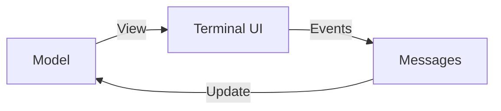

# TUI & Configuration Patterns

GTB leverages the `huh` library to provide a rich, interactive Command Line Interface (CLI) for configuration and setup. This document outlines the design patterns used to ensure these interactions are safe, transparent, and user-friendly.

## Environment Precedence Disclosure

The framework follows a strict configuration merging hierarchy where environment variables often take precedence over file-based settings. To avoid user confusion during interactive setup, the framework explicitly warns when an environment override is active.

### The "Note" Pattern
When a user is prompted to configure a setting that is currently overridden by an environment variable, the framework injects a `huh.NewNote()` to inform the user.

```go
if envProvider := os.Getenv("AI_PROVIDER"); envProvider != "" {
    providerFields = append([]huh.Field{
        huh.NewNote().
            Title("⚠ Environment Override Detected").
            Description(fmt.Sprintf(
                "AI_PROVIDER is set to %q. This environment variable takes precedence over the config file.",
                envProvider,
            )),
    }, providerFields...)
}
```

## Sensitive Data Handling

Handling API keys and tokens requires extra care. The framework employs several patterns to handle sensitive data in a TUI environment.

### 1. Masked Hints
When re-configuring a feature (e.g., updating an AI provider key), the framework should not display the existing key in plain text. Instead, it uses a masked hint showing only the last few characters.

```go
func maskKey(key string) string {
    const visibleChars = 4
    if len(key) <= visibleChars { return "****" }
    return "****" + key[len(key)-visibleChars:]
}
```

### 2. Echo Modes
All sensitive fields use `huh.EchoModePassword` to prevent the raw input from appearing on the screen or in terminal history.

### 3. "Blank to Keep" Rationale
The framework follows the pattern of allowing users to leave sensitive fields blank to keep their existing values. This prevents users from being forced to find and re-paste keys they have already configured.

## Multi-Stage Setup Flows

Complex features often require branching configuration logic. The framework handles this by splitting the TUI into discrete stages (Forms).

1.  **Stage 1: Strategy Selection**: The user selects a provider or method (e.g., OpenAI vs. Gemini).
2.  **Stage 2: Targeted Configuration**: The second stage is built lazily based on the first selection, prompting only for the fields required by that specific strategy.

## Key Principles

- **Transparency**: Never let a hidden variable (like an ENV var) silently override a user's interactive selection.
- **Safety**: Always mask sensitive data and use secure echo modes.
- **Efficiency**: Use existing configuration values as defaults or hints to speed up the setup process.
- **Independence**: TUI logic should be decoupled from the core business logic, usually residing in `pkg/setup/` subdirectories.

---

## Bubble Tea Application Architecture

GTB uses [Bubble Tea](https://github.com/charmbracelet/bubbletea) for complex interactive applications like the documentation browser. This section covers the architectural patterns used.

### The Elm Architecture

Bubble Tea implements the Elm Architecture (TEA), which consists of three core concepts:



1. **Model**: Application state struct
2. **Update**: Pure function `(Model, Msg) → (Model, Cmd)` that handles messages
3. **View**: Pure function `Model → string` that renders the UI

### Documentation Browser Model

The `pkg/docs` TUI demonstrates a complete Bubble Tea application:

```go
type Model struct {
    fs fs.FS // Embedded documentation filesystem
    
    // Navigation state
    navRoot      []NavNode
    currentItems []ListItem
    navStack     [][]ListItem
    cursor       int
    
    // Search state
    searchInput       textinput.Model
    showSearchInput   bool
    searchResults     []SearchResult
    useRegex          bool
    
    // AI Ask state
    askInput     textinput.Model
    showAskInput bool
    asking       bool
    askFunc      AskFunc
    
    // Layout state
    focus        focus  // focusSidebar or focusContent
    sidebarOpen  bool
    sidebarRatio float64
    
    // Components
    viewport viewport.Model
    renderer *glamour.TermRenderer
    
    // Dimensions
    width, height int
    ready         bool
}
```

### Focus Management Pattern

The documentation browser uses a focus state machine to manage keyboard input routing:

```go
type focus int

const (
    focusSidebar focus = iota
    focusContent
)

func (m *Model) Update(msg tea.Msg) (tea.Model, tea.Cmd) {
    switch msg := msg.(type) {
    case tea.KeyMsg:
        // Route input based on current focus
        switch m.focus {
        case focusSidebar:
            return m.handleSidebarKeys(msg)
        case focusContent:
            return m.handleContentKeys(msg)
        }
    }
    return m, nil
}
```

### Async Operations with Commands

Bubble Tea uses commands for async operations. The documentation browser demonstrates this pattern for AI queries:

```go
// Message types for async results
type AskResultMsg struct {
    Response string
    Err      error
}

type AskLogMsg struct {
    Log string
    Ch  <-chan string
}

// Command to perform async AI query
func (m *Model) performAsk(question string) tea.Cmd {
    return func() tea.Msg {
        logCh := make(chan string, 10)
        
        go func() {
            defer close(logCh)
            response, err := m.askFunc(question, func(msg string, _ log.Level) {
                logCh <- msg
            })
            // Result handled via channel
        }()
        
        return AskLogMsg{Ch: logCh}
    }
}

// Handle result in Update
func (m *Model) Update(msg tea.Msg) (tea.Model, tea.Cmd) {
    switch msg := msg.(type) {
    case AskResultMsg:
        m.asking = false
        if msg.Err != nil {
            m.content = fmt.Sprintf("Error: %v", msg.Err)
        } else {
            m.content = msg.Response
        }
    case AskLogMsg:
        m.askLogs = append(m.askLogs, msg.Log)
        return m, waitForAskLog(msg.Ch) // Continue listening
    }
    return m, nil
}
```

### Functional Options for TUI Configuration

The documentation browser uses functional options for customization:

```go
type Option func(*Model)
type AskFunc func(question string, log func(string, log.Level)) (string, error)

func WithTitle(title string) Option {
    return func(m *Model) {
        m.title = title
    }
}

func WithAskFunc(fn AskFunc) Option {
    return func(m *Model) {
        m.askFunc = fn
    }
}

// Usage
model := docs.New(assets,
    docs.WithTitle("My Documentation"),
    docs.WithAskFunc(myAIHandler),
)
```

### Component Composition

Bubble Tea encourages composing smaller components. The documentation browser includes:

| Component | Purpose |
| :--- | :--- |
| `viewport.Model` | Scrollable content area with momentum |
| `textinput.Model` | Search and AI query input fields |
| `glamour.TermRenderer` | Markdown to terminal rendering |

```go
func New(docFS fs.FS, opts ...Option) *Model {
    m := &Model{
        fs:           docFS,
        sidebarOpen:  true,
        sidebarRatio: defaultSidebarRatio,
        focus:        focusSidebar,
        titles:       make(map[string]string),
    }
    
    // Initialize sub-components
    m.searchInput = textinput.New()
    m.searchInput.Placeholder = "Search..."
    
    m.askInput = textinput.New()
    m.askInput.Placeholder = "Ask a question..."
    
    m.searchViewport = viewport.New(0, 0)
    
    // Apply options
    for _, opt := range opts {
        opt(m)
    }
    
    return m
}
```

### Styling with Lipgloss

GTB uses [Lipgloss](https://github.com/charmbracelet/lipgloss) for consistent styling:

```go
var (
    styleSidebar = lipgloss.NewStyle().
        Border(lipgloss.RoundedBorder()).
        BorderForeground(lipgloss.Color("62")).
        Padding(0, 1)
    
    styleSelected = lipgloss.NewStyle().
        Foreground(lipgloss.Color("205")).
        Bold(true)
    
    styleDir = lipgloss.NewStyle().
        Foreground(lipgloss.Color("69"))
    
    styleHelp = lipgloss.NewStyle().
        Foreground(lipgloss.Color("241")).
        PaddingTop(1)
)

func (m *Model) View() string {
    sidebar := styleSidebar.
        Width(sidebarWidth).
        Height(m.height - 4).
        Render(m.renderNavigation())
    
    content := styleContent.Render(m.viewport.View())
    
    return lipgloss.JoinHorizontal(lipgloss.Top, sidebar, content)
}
```

### Best Practices for Bubble Tea Applications

**1. Keep Update Pure**
:   The Update function should be free of side effects. Use commands for I/O.

**2. Use Typed Messages**
:   Define specific message types rather than generic ones:
    
    ```go
    // ✓ Good: Typed message
    type FileLoadedMsg struct {
        Path    string
        Content []byte
    }
    
    // ✗ Avoid: Generic message
    type GenericMsg struct {
        Type string
        Data interface{}
    }
    ```

**3. Separate View Logic**
:   Break the View function into smaller render methods:
    
    ```go
    func (m *Model) View() string {
        return lipgloss.JoinVertical(lipgloss.Left,
            m.renderHeader(),
            m.renderContent(),
            m.renderFooter(),
        )
    }
    ```

**4. Handle Window Resize**
:   Always respond to `tea.WindowSizeMsg`:
    
    ```go
    case tea.WindowSizeMsg:
        m.width = msg.Width
        m.height = msg.Height
        m.updateViewportSize()
    ```

---

## Related Documentation

- **[Functional Options](functional-options.md)**: Pattern used for TUI configuration
- **[Controls Package](../components/controls.md)**: Service lifecycle for TUI applications
- **[Docs Command](../components/commands/docs.md)**: Using the documentation browser

