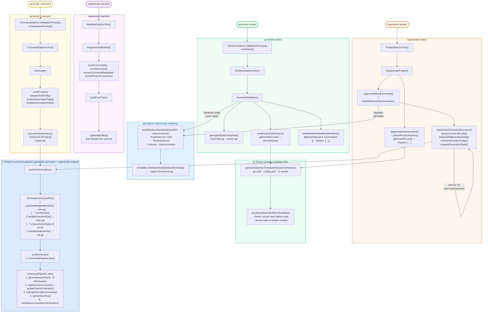

# Code Generation Flows

This document maps the complete call graphs for all generation and regeneration commands, identifies where their codepaths intersect, and explains the architectural intent behind shared vs. command-specific logic.

---

## Combined Call Graph

The diagram below shows all four commands simultaneously. There are three shared subgraphs: **Shared root/cmd.go rendering** (intersection of `generate project` and `regenerate project`), **Shared skeleton template files** (intersection of `generate project` and `regenerate project`), and **Shared command pipeline** (intersection of `generate command` and `regenerate project`). `regenerate manifest` has an entirely independent pipeline.



---

## Entrypoints

| Command | Package | Cobra handler | Generator method |
|---|---|---|---|
| `generate project` | `internal/cmd/generate/project.go` | `SkeletonOptions.Run()` | `GenerateSkeleton()` |
| `generate command` | `internal/cmd/generate/command.go` | `CommandOptions.Run()` | `Generate()` |
| `regenerate project` | `internal/cmd/regenerate/project.go` | `ProjectOptions.Run()` | `RegenerateProject()` |
| `regenerate manifest` | `internal/cmd/regenerate/manifest.go` | `ManifestOptions.Run()` | `RegenerateManifest()` |

---

## Shared Intersections

There are two distinct shared codepaths — one for the root command file and one for individual command files.

### Root command: `buildSkeletonRootData`

Both `generate project` and `regenerate project` render `pkg/cmd/root/cmd.go` via the same Jennifer template (`templates.SkeletonRoot`). The data for that template is now built through a shared helper `buildSkeletonRootData` (`regenerate.go`) that maps all manifest fields — including help channel configuration — to a complete `SkeletonRootData`:

```
generate project                              regenerate project
  generateSkeletonGoFiles()                     regenerateRootCommand()
    │                                             └─ buildSkeletonSubcommands()
    │  (SkeletonConfig — user input)              │
    └──────────────────────────────────────────►  buildSkeletonRootData(manifest, subcommands)
                                                     · Properties.Name / Description
                                                     · Properties.Features → Disabled/EnabledFeatures
                                                     · Properties.Help → HelpType / SlackChannel / …
                                                     · ReleaseSource → Provider / Org / Repo / Host
                                                     · subcommands ([] on first creation)
                                                  └─ templates.SkeletonRoot(data)
                                                     → pkg/cmd/root/cmd.go
```

Both paths call `templates.SkeletonRoot` with data from `buildSkeletonRootData`; the only difference is the upstream source — `SkeletonConfig` (user input at creation time) on the left, the persisted `Manifest` on the right.

| Field | `generate project` source | `regenerate project` source |
|---|---|---|
| `Name`, `Description` | `SkeletonConfig` | `Manifest.Properties` |
| `ReleaseProvider`, `Org`, `RepoName`, `Host`, `Private` | `SkeletonConfig` | `Manifest.ReleaseSource` |
| `DisabledFeatures`, `EnabledFeatures` | `SkeletonConfig.Features` | `Manifest.Properties.Features` |
| `HelpType`, `SlackChannel`, `SlackTeam`, `TeamsChannel`, `TeamsTeam` | `SkeletonConfig` | `Manifest.Properties.Help` |
| `Subcommands` | _(empty — no commands at creation)_ | Built from `Manifest.Commands` |

All fields are now correctly propagated through regeneration. Previously `regenerateRootCommand` omitted the five help fields, silently zeroing them on every `regenerate project` run.

---

### Command files: `performGeneration` → `CommandPipeline`

This is the second intersection. Every command that writes individual command files flows through this pair:

```
performGeneration(ctx, cmdDir, data)             [commands.go]
  └─ GenerateCommandFile(ctx, cmdDir, data)       [files.go]
       ├─ generateRegistrationFile()   → cmd.go   (Jennifer AST → Go source)
       │    └─ verifyHash()            → guards user-modified files
       ├─ handleExecutionFile()        → main.go  (create new OR inject stubs into existing)
       │    └─ ensureHookStubs()
       └─ handleInitializerFile()      → init.go  (create OR delete based on WithInitializer)

postGenerate(ctx, data, cmdDir)                   [commands.go]
  └─ CommandPipeline.Run()                         [pipeline.go]
       ├─ Step 1: generateAssetFiles()             → assets/  (fatal — only when WithAssets)
       ├─ Step 2: registerSubcommand()             → injects AddCommand into parent cmd.go
       │          updateParentCmdHash()            → refreshes parent's hash in manifest
       ├─ Step 3: reRegisterChildCommands()        → re-injects existing children after overwrite
       ├─ Step 4: updateManifest()                 → writes .gtb/manifest.yaml  (advisory)
       └─ Step 5: handleDocumentationGeneration()  → generates or updates docs  (advisory)
```

Steps 1 (asset files) is **fatal** — a failure stops the pipeline. Steps 2–5 are **advisory** — failures are logged as warnings and accumulated in `PipelineResult.Warnings` rather than aborting the run.

**`generate command`** calls `performGeneration` once (for the single target command) then `postGenerate`.

**`regenerate project`** calls `regenerateCommandRecursive` which calls `performGeneration` then `postGenerate` for every command in the manifest tree, depth-first.

**`regenerate manifest`** does **not** call `performGeneration` or `postGenerate` — it only scans source files and writes `manifest.yaml`.

**`generate project`** does **not** call `performGeneration` or `postGenerate` — it writes a full project skeleton and an empty manifest. Individual commands are added afterwards via `generate command`.

---

## Key Types

| Type | File | Purpose |
|---|---|---|
| `CommandPipeline` | `pipeline.go` | Owns the ordered post-generation steps shared by both `generate command` and `regenerate project`. Constructed with `newCommandPipeline(g, opts)` and executed via `Run()`. |
| `PipelineOptions` | `pipeline.go` | Controls which steps run: `SkipAssets`, `SkipDocumentation`, `SkipRegistration`. Zero value enables all steps. |
| `PipelineResult` | `pipeline.go` | Returned by `Run()`. Contains `Warnings []StepWarning` — a slice of non-fatal step failures the caller can inspect. |
| `ManifestCommandUpdate` | `manifest_update.go` | Struct passed to `updateCommandRecursive` carrying all fields for a manifest command entry. Replaces a 14-parameter function signature. |
| `CommandContext` | `context.go` | Value type holding the fully resolved config for a single command invocation. Used by `reRegisterChildCommands` to construct child generators without the bare-`Config` foot-gun. |

---

## Unique Code by Command

### `generate project` — only path

| Function | File | Purpose |
|---|---|---|
| `runWizard()` | `internal/cmd/generate/project.go` | Multi-stage huh form: project basics, git config, help config |
| `GenerateSkeleton()` | `skeleton.go` | Top-level orchestrator: loads stored hashes, writes Go files + template files, persists manifest with hashes |
| `generateSkeletonGoFiles()` | `skeleton.go` | Renders `main.go`, `version.go`, `root/cmd.go` via Jennifer |
| `loadProjectFileHashes()` | `skeleton.go` | Reads existing manifest and returns its top-level `Hashes` map (empty map on first run) |
| `writeSkeletonManifest(fileHashes)` | `skeleton.go` | Creates the initial `manifest.yaml` with empty `commands: []` and the written file hashes |
| `splitRepoPath()` | `skeleton.go` | Parses `org/repo` format from repo flag |
| `releaseProviderForHost()` | `skeleton.go` | Maps host string to GitHub or GitLab provider |
| `resolveGoVersion()` | `skeleton.go` | Detects Go toolchain version for `go.mod` |

### `generate command` — only path

| Function | File | Purpose |
|---|---|---|
| `runInteractivePrompt()` | `internal/cmd/generate/command.go` | Multi-stage huh wizard: main config, flag definitions, AI prompt |
| `checkProtection()` | `commands.go` | Rejects regeneration of protected commands |
| `processAIGeneration()` / `handleAIGeneration()` | `commands.go` | Calls AI API to generate RunX implementation |
| `startAIGeneration()` / `resolveInput()` | `commands.go` | Resolves prompt source and executes AI request |
| `verifyAndFixProject()` | `commands.go` | Post-generation lint/test verification loop with AI fixes |

### `regenerate project` — only path

| Function | File | Purpose |
|---|---|---|
| `RegenerateProject()` | `regenerate.go` | Reads manifest, regenerates root + all commands + skeleton template files |
| `regenerateRootCommand()` | `regenerate.go` | Re-renders `pkg/cmd/root/cmd.go` via `buildSkeletonRootData` + `SkeletonRoot` |
| `buildSkeletonRootData()` | `regenerate.go` | Maps all manifest fields (incl. `Properties.Help`) to `SkeletonRootData` — the authoritative manifest → root data builder |
| `buildSkeletonSubcommands()` | `regenerate.go` | Builds `[]SkeletonSubcommand` from manifest commands for root template |
| `regenerateCommandRecursive()` | `regenerate.go` | Depth-first traversal calling `performGeneration` + `postGenerate` per command |
| `setupCommandConfig()` | `regenerate.go` | Populates generator config from a manifest command entry |
| `prepareRegenerationData()` | `regenerate.go` | Builds `CommandData` from manifest (flags, options, metadata) |
| `regenerateSkeletonFiles()` | `regenerate.go` | Reconstructs skeleton template data from manifest, calls `generateSkeletonTemplateFiles`, merges hashes |
| `persistProjectHashes()` | `regenerate.go` | Reads current manifest, sets `Hashes` field, writes it back to disk |

### `regenerate manifest` — only path

| Function | File | Purpose |
|---|---|---|
| `RegenerateManifest()` | `manifest_scan.go` | Scans `pkg/cmd` and rebuilds `manifest.yaml` from source files |
| `scanCommands()` / `scanRecursive()` | `manifest_scan.go` | Walks directory tree discovering command packages |
| `extractCommandMetadata()` | `ast_extract.go` | AST-parses each `cmd.go` to recover name, flags, aliases, etc. |
| `extractProjectProperties()` | `ast_extract.go` | AST-parses `root/cmd.go` to recover tool name, description, release config |
| `linkParentChild()` / `buildCmdTree()` | `manifest_scan.go` | Reconstructs the command hierarchy from flat scan results |

---

## Shared Functions Reference

These functions are called by more than one command path.

| Function | File | Called by |
|---|---|---|
| `verifyProject()` | `generator.go` | generate command, regenerate project |
| `resolveGenerationFlags()` | `commands.go` | generate command, regenerate project |
| `parseFlags()` | `commands.go` | generate command, regenerate project |
| `loadFlagsFromManifest()` | `manifest_query.go` | generate command, regenerate project |
| `syncConfigWithCommand()` | `manifest_query.go` | generate command, regenerate project |
| `prepareGenerationData()` | `commands.go` | generate command, regenerate project |
| `categorizeFlags()` | `commands.go` | generate command, regenerate project |
| `convertFlagsToTemplate()` | `commands.go` | generate command, regenerate project |
| `resolveAncestralFlags()` | `commands.go` | generate command, regenerate project |
| `shouldOmitRun()` | `files.go` | generate command, regenerate project |
| `performGeneration()` | `commands.go` | generate command, regenerate project |
| `GenerateCommandFile()` | `files.go` | generate command, regenerate project |
| `generateRegistrationFile()` | `files.go` | generate command, regenerate project |
| `verifyHash()` | `hash.go` | generate command, regenerate project |
| `handleExecutionFile()` | `files.go` | generate command, regenerate project |
| `ensureHookStubs()` | `stubs.go` | generate command, regenerate project |
| `handleInitializerFile()` | `files.go` | generate command, regenerate project |
| `postGenerate()` / `CommandPipeline.Run()` | `commands.go` / `pipeline.go` | generate command, regenerate project |
| `registerSubcommand()` | `ast.go` | generate command, regenerate project |
| `updateParentCmdHash()` | `manifest_update.go` | generate command, regenerate project |
| `reRegisterChildCommands()` | `pipeline.go` | generate command, regenerate project |
| `updateManifest()` | `manifest_update.go` | generate command, regenerate project |
| `handleDocumentationGeneration()` | `commands.go` | generate command, regenerate project |
| `loadManifest()` | `manifest.go` | generate command, regenerate project, regenerate manifest |
| `findManifestCommand()` | `manifest_query.go` | generate command, regenerate project, regenerate manifest |
| `getCommandPath()` | `ast.go` | generate command, regenerate project |
| `getParentPathParts()` | `ast.go` | generate command, regenerate project, regenerate manifest |
| `getModuleName()` | `generator.go` | generate command, regenerate project, regenerate manifest |
| `calculateHash()` | `hash.go` | generate command, regenerate project, regenerate manifest |
| `buildSkeletonSubcommands()` | `regenerate.go` | regenerate project, (generate project via SkeletonRoot) |
| `generateSkeletonTemplateFiles()` | `skeleton.go` | generate project, regenerate project |
| `renderAndHashSkeletonTemplate()` | `skeleton.go` | generate project, regenerate project |

---

## Manifest Lifecycle

```
generate project
  ├─ writeSkeletonManifest()    → creates manifest.yaml (commands: [] · Hashes: {file → sha256, …})
  └─ loadProjectFileHashes()    → reads existing Hashes before writing (detects customisations on re-run)

generate command
  └─ updateManifest()           → adds/updates a single command entry

regenerate project
  ├─ updateManifest() × N       → updates every command entry (via postGenerate in recursion)
  └─ persistProjectHashes()     → updates Manifest.Hashes with hashes of re-written skeleton files

regenerate manifest
  └─ RegenerateManifest()       → rebuilds commands list from source, preserves properties/release_source/hashes
```

The manifest is the single source of truth for `regenerate project` — it reads nothing from the filesystem except the manifest itself. `regenerate manifest` does the inverse: it reads the filesystem and reconstructs the manifest, making it a recovery tool when the manifest drifts from the code.

---

## Package Structure

The `internal/generator` package is split into focused files:

| File | Responsibility |
|---|---|
| `commands.go` | `Generate()`, preparation steps, AI generation, `postGenerate` wrapper |
| `pipeline.go` | `CommandPipeline`, `PipelineOptions`, `PipelineResult`, `reRegisterChildCommands` |
| `context.go` | `CommandContext` value type, `buildCommandContext`, `ToConfig` |
| `files.go` | `GenerateCommandFile`, `generateRegistrationFile`, `handleExecutionFile`, `handleInitializerFile`, `generateAssetFiles` |
| `stubs.go` | `ensureHookStubs`, `ensureImport` |
| `hash.go` | `calculateHash`, `verifyHash`, `promptOverwrite` |
| `regenerate.go` | `RegenerateProject`, `regenerateCommandRecursive`, `regenerateRootCommand`, `buildSkeletonRootData`, `buildSkeletonSubcommands`, `regenerateSkeletonFiles`, `persistProjectHashes` |
| `removal.go` | `Remove`, `performRemoval`, `cleanupDocumentation` |
| `manifest.go` | `Manifest` types, `loadManifest`, `MarshalYAML` implementations |
| `manifest_update.go` | `updateManifest`, `updateCommandRecursive`, `ManifestCommandUpdate`, `updateParentCmdHash` |
| `manifest_query.go` | `findManifestCommand`, `findCommandAt`, `loadFlagsFromManifest`, `syncConfigWithCommand` |
| `manifest_scan.go` | `RegenerateManifest`, `scanCommands`, `scanRecursive`, `buildCmdTree` |
| `ast.go` | AST manipulation: `registerSubcommand`, `deregisterSubcommand` |
| `ast_extract.go` | AST reading: `extractCommandMetadata`, `extractProjectProperties` |
| `skeleton.go` | `GenerateSkeleton`, `generateSkeletonGoFiles`, `generateSkeletonTemplateFiles`, `renderAndHashSkeletonTemplate`, `loadProjectFileHashes`, `writeSkeletonManifest` |
| `generator.go` | `Generator` struct, `New`, `verifyProject`, shared utilities |

---

## Key Design Observations

**There are two shared intersections, not one.** The `SkeletonRoot` template is shared between `generate project` and `regenerate project` for rendering `root/cmd.go`. The `CommandPipeline` is shared between `generate command` and `regenerate project` for rendering individual command files. These are independent intersections serving different concerns.

**`CommandPipeline` is the command-file convergence point.** Both `generate command` and `regenerate project` reach the same `performGeneration` → `CommandPipeline.Run()` sequence for every command they write. Any bug fixed or feature added in the pipeline automatically applies to both. `postGenerate` is now a thin wrapper that constructs and runs a pipeline with default options.

**Pipeline steps are explicitly ordered and independently skippable.** `PipelineOptions` allows callers to disable asset generation, documentation, or parent registration independently. This makes the pipeline usable in contexts (e.g., testing, `regenerate project`) where some steps are unwanted without branching inside shared functions.

**`reRegisterChildCommands` uses `buildCommandContext` for correctness.** Child generators are now constructed from a fully resolved `CommandContext` rather than a bare `&Config{Name, Path, Parent}`. This ensures any future `Config` field that affects registration is automatically carried through to child re-registration.

**`ManifestCommandUpdate` eliminates a 14-parameter function signature.** `updateCommandRecursive` previously took 14 positional parameters. New manifest fields now extend the struct rather than cascade through every call site.

**`buildSkeletonRootData` makes the root rendering intersection explicit.** `regenerateRootCommand` now calls `buildSkeletonRootData(manifest, subcommands)` — the single authoritative function that maps every manifest field to `SkeletonRootData`, including the five `ManifestHelp` fields (`HelpType`, `SlackChannel`, `SlackTeam`, `TeamsChannel`, `TeamsTeam`) that were previously silently dropped on every regeneration. Adding a new project-level setting to the manifest now requires updating only this one function.

**Project skeleton files are now hash-tracked and protected.** `Manifest.Hashes` (top-level `map[string]string`, keyed by relative file path) records the SHA256 of every file written by `generateSkeletonTemplateFiles`. Before overwriting any existing file, `renderAndHashSkeletonTemplate` compares the current content hash against the stored value. A mismatch means the user has customised the file — the generator prompts before overwriting and skips non-interactively. Both `generate project` (via `writeSkeletonManifest`) and `regenerate project` (via `persistProjectHashes`) update `Manifest.Hashes` after each run, so customisation state is tracked across invocations.

**`generate project` is otherwise separate.** Beyond the shared skeleton template and `SkeletonRoot` template it shares with `regenerate project`, it writes files that are never touched by the per-command pipeline (`cmd/main.go`, CI assets) and creates an empty manifest. It does not participate in the per-command generation pipeline at all.

**`regenerate manifest` is a recovery tool.** It is the only command that does not write Go source files — it only reads them. It does not share either the `SkeletonRoot` template or the `CommandPipeline` sequence.
